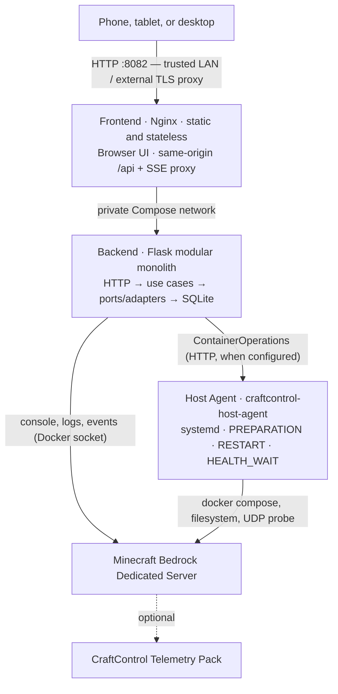
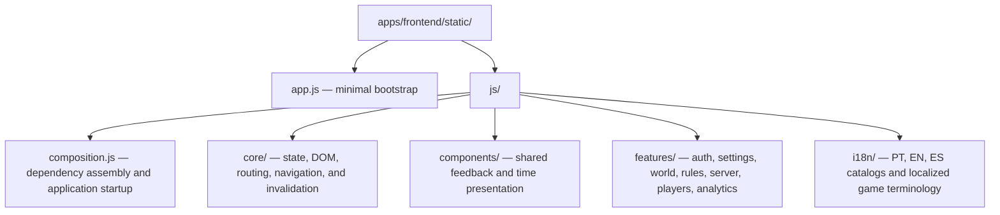
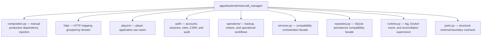
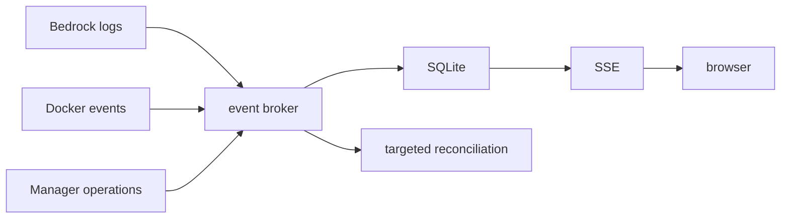

<div align="center">
  <p><a href="README.pt-BR.md">Leia em Português (Brasil)</a></p>
  
  <h1>CraftControl</h1>
  <p><strong>A mobile-first control center for Minecraft Bedrock servers.</strong></p>
  <p>Manage worlds, players, rules, access, backups, and structured gameplay statistics without living in a server console.</p>
  <p>
    <a href="https://github.com/dgaramos/craftcontrol/actions/workflows/quality.yml"></a>
    <a href="https://codecov.io/gh/dgaramos/craftcontrol"></a>
    <a href="LICENSE"></a>
    <a href="https://www.python.org/"></a>
    <a href="https://flask.palletsprojects.com/"></a>
    <a href="https://www.sqlite.org/"></a>
    <a href="https://www.docker.com/"></a>
  </p>
  <p>
    <a href="https://nginx.org/"></a>
    <a href="https://developer.mozilla.org/docs/Web/JavaScript"></a>
    <a href="packages/contracts/openapi.json"></a>
    <a href="#contracts-and-api-documentation"></a>
    
  </p>
</div>

> [!IMPORTANT]
> CraftControl targets trusted private networks. Local authentication and CSRF protection are active, but TLS termination and restricted Docker access remain deployment requirements. Do not expose port `8082` directly to the Internet.

## What CraftControl provides

- Purpose-built controls for server properties, gamerules, time, weather, permissions, packs, and lifecycle operations.
- Permanent player profiles with aliases, sessions, play time, deaths, permissions, and individual telemetry.
- Global activity, death, ranking, block, combat, exploration, and 7/30-day analytics.
- A companion Behavior Pack for authoritative kills, blocks, damage, distance, dimensions, and structured deaths.
- Coordinated world and SQLite backups with verification, retention, offline restore, and recovery copies.
- Player-backed owner, operator, and viewer accounts with opaque sessions and session-bound CSRF tokens.
- A responsive interface in Portuguese, English, and Spanish with original CraftControl pixel-art icons.

The manager remains useful without the Telemetry Pack, Prometheus, Grafana, Loki, or any external observability service.

## Interface

The six primary areas are task-oriented:

| Area | Responsibility |
| --- | --- |
| Home | Server health, online players, freshness, and shortcuts |
| World | World identity, generation, time, weather, and cycles |
| Players | Permanent profiles, sessions, access, permissions, and individual telemetry |
| Data | Activity, deaths, rankings, blocks, combat, exploration, and periods |
| Rules | Gameplay, interface, mobs, drops, commands, fire, TNT, and regeneration |
| Server | Telemetry Pack, network, performance, backups, and container lifecycle |

Navigation is encoded in the URL, so refreshing a browser preserves the active area. Persistent setting changes enter a review drawer; lightning-marked gamerules apply immediately.

## Architecture

CraftControl is a monorepo with two independently deployable containerized application services, not a set of microservices. The backend remains a modular monolith; an optional systemd host agent is a separate host-level execution boundary.



The frontend owns the public origin. Nginx serves static assets and proxies `/api/*`, including unbuffered Server-Sent Events, to the private backend. The frontend has no persistent or privileged mounts. The backend owns durable state (SQLite), Bedrock files, coordinated backups, console operations, log streaming, and Docker events.

CraftControl has three runtime boundaries: the **frontend** (Nginx container serving static assets and proxying the API), the **backend** (Flask modular monolith inside Docker managing state, auth, and Bedrock operations), and the **host agent** (`craftcontrol-host-agent`, a systemd service running on the Docker host outside all containers).

When the host agent is configured (`HOST_AGENT_URL` is set), server lifecycle operations — `PREPARATION` (writing configuration), `RESTART` (restarting the Compose service), and `HEALTH_WAIT` (polling the Bedrock UDP probe) — are delegated to the host agent over an authenticated HTTP channel. The agent handles Docker socket access for those three stages so the backend does not need to execute them directly; the Docker socket remains mounted in the backend for Bedrock console attachment, log streaming, and Docker events, which are not part of the host-agent contract. Without the host agent, the backend performs all lifecycle operations directly.

The host agent is intentionally **not** a Docker container. Containerizing it would require either mounting the Docker socket into the container (defeating least-privilege isolation) or using privileged host mounts with elevated network namespaces. Running it as a systemd service on the host gives Docker socket access through OS-level group membership without exposing the socket to the container network or the backend image.

The backend intentionally runs one Gunicorn worker with multiple threads. Its event broker, supervisors, refresh lock, and SSE delivery are process-local; multiple workers would duplicate those responsibilities.

### Repository ownership

```mermaid
flowchart TD
    repo["CraftControl repository"] --> apps["apps/"]
    apps --> frontend["frontend/ — Nginx image, HTML, CSS, and native ES modules"]
    apps --> backend["backend/ — Flask image, composition root, and Python application"]
    repo --> services["services/"]
    services --> hostagentsvc["host-agent/ — independently deployed systemd service (host-level, outside Docker)"]
    repo --> contracts["packages/contracts/ — canonical OpenAPI 3.1 contract and generated types"]
    repo --> telemetry["packs/telemetry/ — embedded Behavior Pack and lifecycle assets"]
    repo --> bin["bin/ — quality, deployment, cutover, backup, and recovery commands"]
    repo --> deploy["deploy/ — deployment-only assets (systemd units, install scripts)"]
    repo --> docs["docs/ — architecture, security, telemetry, and operations guides"]
    repo --> overlay["minecraft_manager/, app.py, wsgi.py — temporary backend compatibility overlays"]
    repo --> split["docker-compose.split.yml — active split production topology"]
    repo --> combined["docker-compose.yml — combined compatibility/recovery topology"]
    repo --> versions["versions.env — tested frontend/backend release pair"]
```



Root Python links and the combined image are compatibility overlays. They preserve existing tooling and emergency rollback while migration continues; new application code belongs under `apps/`.

### Frontend modules

The frontend uses browser-native ES modules with no bundler or build-time framework.



`app.js` starts the composition root. Feature modules own their markup, bindings, and local state; core modules do not import features. Shared dependencies are explicit, and the interaction gate executes navigation, authentication, player sessions, individual telemetry, analytics, responsive behavior, SSE invalidation, and localization paths.

### Backend layers



Routes translate HTTP requests and responses. Use cases coordinate behavior. Repositories own persistence. Adapters isolate Docker, Bedrock console, files, and Telemetry Pack installation. Production dependencies are assembled manually; there is no service locator or dependency-injection framework.

See [Architecture](docs/architecture.md) for dependency rules, event consistency, deliberate non-goals, and the incremental target layout.

### Contracts and API documentation

`packages/contracts/openapi.json` is the canonical OpenAPI 3.1 business contract. Generated frontend declarations live at `apps/frontend/static/js/api-contract.d.ts`; the quality gate rejects stale declarations.

Authenticated installations expose:

- `/api/openapi.json` — machine-readable contract;
- `/api/docs` — Swagger UI using the current session;
- `/api/events` — persisted and live Server-Sent Events.
- `/api/diagnostics` — owner-only local telemetry and SSE diagnostics; it does not require an observability stack.

`GET /api/operations` returns bounded, paginated operation history through a one-based `page` query parameter and a `limit` page size from 1 to 100 (default 10).

Swagger attaches the session-bound CSRF token to unsafe “Try it out” requests and never bypasses role capabilities. There is no arbitrary shell or console endpoint.

## Event-driven state and telemetry

CraftControl follows Bedrock logs and Docker lifecycle events, commits durable evidence to SQLite, publishes changes through SSE, performs targeted refreshes, and runs a full safety reconciliation every 15 minutes by default.



Cached values retain observation and change timestamps. Stale information remains visible and marked instead of being replaced by false empty data.

The optional CraftControl Telemetry Pack currently ships as `0.3.1`. It emits schema-versioned JSON and supports authoritative snapshots plus incremental events. Block changes are coalesced into five-second batches. Sequence gaps, resets, missing ranges, blocked storage, and partial Bedrock capabilities degrade health and request a coalesced snapshot. Stale deltas are rejected; health returns to healthy only after complete reconciliation.

Snapshots can recover lifetime aggregates after downtime. They cannot recreate every missed historical event, timestamp, cause, or coordinate, and CraftControl never invents that detail.

The Server area reports the frontend image, backend image, installed Behavior Pack, pack response time, sequence, completed snapshot, gaps, missing events, storage migration, and supported metrics separately. Installation, upgrade, disable, removal, backup, and rollback are available through the interface and CLI. Pack changes never restart Bedrock automatically.

```bash
docker compose -f docker-compose.split.yml exec craftcontrol-backend craftcontrol telemetry status
docker compose -f docker-compose.split.yml exec craftcontrol-backend craftcontrol telemetry install
```

See [Telemetry Pack integration](docs/telemetry-pack.md) for the lifecycle and recovery runbook.

## Installation

CraftControl requires Docker Engine with the Compose plugin and an existing
`itzg/minecraft-bedrock-server` deployment. It runs alongside the Bedrock
project and must be deployed with its guarded commands. Never run a bare `docker compose up` from a development checkout. Coordinated releases prepare both versioned images before recreating either service and attempt image builds up to three times.

See [Installation](docs/installation.md) for prerequisites, expected directory
layout, configuration, cutover, access, post-install checks, and troubleshooting.

## Configuration

| Variable | Default | Purpose |
| --- | --- | --- |
| `MANAGER_PORT` | `8082` | Public frontend port |
| `MINECRAFT_CONTAINER` | `minecraft-bedrock` | Bedrock container managed by CraftControl |
| `MINECRAFT_PROJECT` | `/minecraft-project` | Bedrock Compose project inside the backend |
| `DATABASE_PATH` | `/data/manager.db` | SQLite state and player history |
| `BACKUP_ROOT` | `/data/backups/coordinated` | Coordinated recovery sets |
| `BOOTSTRAP_OPERATOR` | `VonCrush` | Initial in-game operator compatibility setting |
| `RECONCILE_SECONDS` | `900` | Full safety-reconciliation interval |
| `AUTH_MODE` | `local` | Built-in authentication; `disabled` is recovery compatibility only |
| `AUTH_COOKIE_SECURE` | `true` | Restrict session cookies to HTTPS |
| `TZ` | `America/Sao_Paulo` | Runtime and analytics timezone |

The running frontend and backend versions come from `versions.env`. Old service names, database filenames, package paths, and environment variables remain supported as compatibility overlays; persistent paths are not renamed destructively.

The host agent is optional. When it is enabled, configure `HOST_AGENT_URL` and `HOST_AGENT_TOKEN_FILE` for the backend; see [Host agent](docs/host-agent.md) for the shared-secret, systemd, and path configuration.

## Authentication and access

Panel accounts attach to players Bedrock has already observed. Private XUID-backed identity survives Gamertag changes; XUIDs never appear in public API responses or the interface.

| Capability | Viewer | Operator | Owner |
| --- | :---: | :---: | :---: |
| Read status, players, history, and telemetry | Yes | Yes | Yes |
| Change settings, gamerules, time, and weather | No | Yes | Yes |
| Start and restart Bedrock | No | Yes | Yes |
| Stop Bedrock | No | No | Yes |
| Change in-game operator permission | No | Yes | Yes |
| Manage panel users and the Telemetry Pack | No | No | Yes |

Minecraft permission and CraftControl role are independent. API capabilities are the security boundary; hiding a browser control is not authorization.

Generate the first one-time owner code after that player has joined Bedrock:

```bash
docker compose -f docker-compose.split.yml exec craftcontrol-backend \
  craftcontrol auth bootstrap --player VonCrush
```

Owners generate invitation or recovery codes from an individual player profile. Codes expire after 15 minutes, work once, and are stored only as hashes. Passwords use salted `scrypt`; opaque server-side sessions have idle and absolute expiration. Every authenticated mutation requires a CSRF token tied to the exact session and a valid same-origin request.

Authenticated users can change their own password from the account control. CraftControl verifies the current password, revokes the account's existing sessions, and issues a fresh session only to the browser completing the change.

See [Local authentication and authorization](docs/authentication.md).

## Player data and analytics

SQLite stores permanent profiles, aliases, presence, sessions, accumulated play time, permissions, deaths, event history, and optional structured telemetry. Disconnecting a player closes or infers the session; it never deletes the profile.

The Players area consolidates one player’s lifetime totals and breakdowns before recent evidence: kills by creature, blocks by type, exploration by dimension, sessions, deaths, and technical history. The Data area provides server-wide filtered and paginated views. Structured and derived deaths are deduplicated for display while raw evidence remains private.

Creature, block, projectile, navigation, action, state, and metric icons use original bundled SVG pixel art. Game identifiers are localized in Portuguese, English, and Spanish, with a localized neutral fallback for unknown identifiers. See [Visual system rules](docs/design-system.md).

## Backups and recovery

CraftControl does not own the Minecraft world. The world remains in the Bedrock project; manager state lives in `manager.db`. SQLite migrations are transactional and create an immutable database backup before the first pending migration.

Use coordinated commands instead of copying a live database or world:

```bash
docker compose -f docker-compose.split.yml exec craftcontrol-backend craftcontrol backup create
docker compose -f docker-compose.split.yml exec craftcontrol-backend craftcontrol backup list
docker compose -f docker-compose.split.yml exec craftcontrol-backend craftcontrol backup verify BACKUP_ID
```

When Bedrock is running, the backup service holds saves only for the copy window and resumes them even after failure. Recovery sets include the world, SQLite database, server configuration, allowlists, permissions, Behavior Pack files, checksums, and a versioned manifest. Restore is deliberately offline and creates a pre-restore recovery copy.

See [Coordinated backup and restore](docs/backup-and-restore.md) and [Database migrations](docs/database-migrations.md).

## Independent releases and rollback

`versions.env` pins the tested frontend/backend pair. Deploy both or only the changed component:

```bash
bin/deploy-craftcontrol-release --check
bin/deploy-craftcontrol-release

bin/deploy-craftcontrol-frontend
bin/deploy-craftcontrol-backend

bin/deploy-craftcontrol-frontend --rollback VERSION
bin/deploy-craftcontrol-backend --rollback VERSION
bin/deploy-craftcontrol-release --rollback FRONTEND_VERSION BACKEND_VERSION
```

Frontend deployment proves that the backend container is unchanged. Backend deployment creates and verifies a coordinated backup, checks SQLite and persistent mounts, and proves the frontend container was not recreated. `bin/cutover-craftcontrol-split` performs the one-time split cutover and retains the combined image as the explicit emergency compatibility path.

The interface reads `/version.json` from the frontend and release metadata from the backend, keeping image activation separate from Behavior Pack installation and runtime response timestamps.

## Development and quality gates

CraftControl uses Python 3.12, Flask, Gunicorn, SQLite, Docker SDK for Python, Nginx, and dependency-free browser JavaScript.

```bash
bin/check-frontend       # JS syntax, i18n, interaction and visual-contract tests
bin/check-backend        # Python application and persistence tests
bin/check-host-agent     # Standalone host-agent tests and coverage report
bin/check-contracts      # OpenAPI, route surface, Swagger, generated declarations
bin/check-integration    # Compose builds, split runtime, architecture and deploy safety
bin/check                # complete local gate
```

GitHub Actions and Gitea Actions run the six quality gates independently: frontend, backend, host agent, backend contracts, frontend contracts, and integration. Changes use Conventional Commits and production deployment is accepted only from clean, published `main`.

Successful GitHub `main` quality runs deploy automatically through the
repository-scoped homelab runner. The workflow synchronizes Gitea and invokes
the same guarded release command used for manual operations; see [Automated
homelab deployment](docs/automated-deployment.md).

See [Development setup](docs/development-setup.md) for prerequisites, environment configuration, and a guide to common development tasks.

## Security status

Current safeguards include local player-backed accounts, role capabilities, hashed one-time credentials, revocable opaque sessions, login throttling, security audit records, session-bound CSRF, origin validation, strict command allowlists, input validation, atomic configuration writes, hidden XUIDs, and `no-new-privileges`.

Remaining hardening work:

1. replace direct Docker socket access with a restricted operations gateway;
2. document and automate a supported TLS/reverse-proxy boundary;
3. continue removing compatibility overlays after tested migration windows;
4. expand community installation, diagnostics, and release automation.

For the full threat model, current safeguards, and hardening roadmap see [docs/security.md](docs/security.md). To report a vulnerability privately see [SECURITY.md](SECURITY.md).

## Contributing

See [CONTRIBUTING.md](CONTRIBUTING.md) for branch naming, PR title format, metadata requirements, Conventional Commits, quality gate, and CodeRabbit interaction.

### Codex skills

If you use Codex, install the global `cody-dr` portable workflow plugin for
issue authoring, delivery, reviews, and findings handling. CraftControl does
not shadow those lifecycle skills locally; the plugin discovers the shared
project profile automatically.

| Skill | When to use |
|---|---|
| `backend` | Padrões Python: DI, Protocols, `is None`, composition root e fakes |
| `frontend` | Padrões JS: injeção de deps, ESM, i18n e testes |
| `manage-project` | Gerencia issues nos GitHub Project boards |
| `manage-milestone` | Gerencia milestones e audita backlog |

The local skills complement the plugin: Codex continues to follow `AGENTS.md`
and the security instructions. A request to execute an issue
até o PR (inclusive via link) autoriza branch, commit, push e abertura do PR;
merge e deploy continuam exigindo pedido explícito.

The tool-neutral [`.agent-review/craftcontrol/PROFILE.md`](.agent-review/craftcontrol/PROFILE.md)
contains the safeguards specific to Cody DR and Claudio DR reviews. See
[Agent review profile](docs/agent-review-profile.md) to use it with portable
plugins too. Any agent can follow this local profile when it receives the path;
the profile augments generic review skills and does not trigger review by itself.

### Claude Code skills

If you use Claude Code, this repository ships a set of skills in `.claude/agents/` that encode the project's workflow and conventions. Invoke them with `/skill-name`:

| Skill | When to use |
|---|---|
| `$execute-issue <n>` | Executa uma issue do início ao merge — orquestra as três fases abaixo |
| `$start-issue <n>` | Verifica metadados, lê contexto obrigatório, mapeia código, cria branch |
| `$implement` | Detecta camada (backend$frontend), carrega skill especializada, implementa e testa |
| `$handle-pr-findings` | Triagem explícita de findings, correções e respostas nas threads |
| `$ship-issue` | Commit, PR com metadados, CI, CodeRabbit, sync Gitea |
| `$review-pr <PR ou ref>` | Revisão cruzada sob demanda ou re-review incremental de um PR/ref — checklist por camada |
| `$backend` | Padrões Python: DI, Protocols, `is None`, composition root, fakes |
| `$frontend` | Padrões JS: injeção de deps, helpers compartilhados, ESM, i18n |
| `$create-issue` | Workshop PM/Dev Hat → cria issue bem formada com todos os metadados |
| `$manage-project` | Adiciona/lista/audita issues nos project boards |
| `$manage-milestone` | Atribui/lista/audita milestones, detecta backlog solto |

## License and trademarks

Copyright 2026 Danilo Ramos.

CraftControl is licensed under the [Apache License 2.0](LICENSE). The license
applies to the original CraftControl source code, documentation, Telemetry Pack,
and visual assets contained in this repository unless a file states otherwise.

CraftControl is independent and is not affiliated with Mojang Studios or Microsoft. Minecraft is a trademark of Microsoft Corporation.
