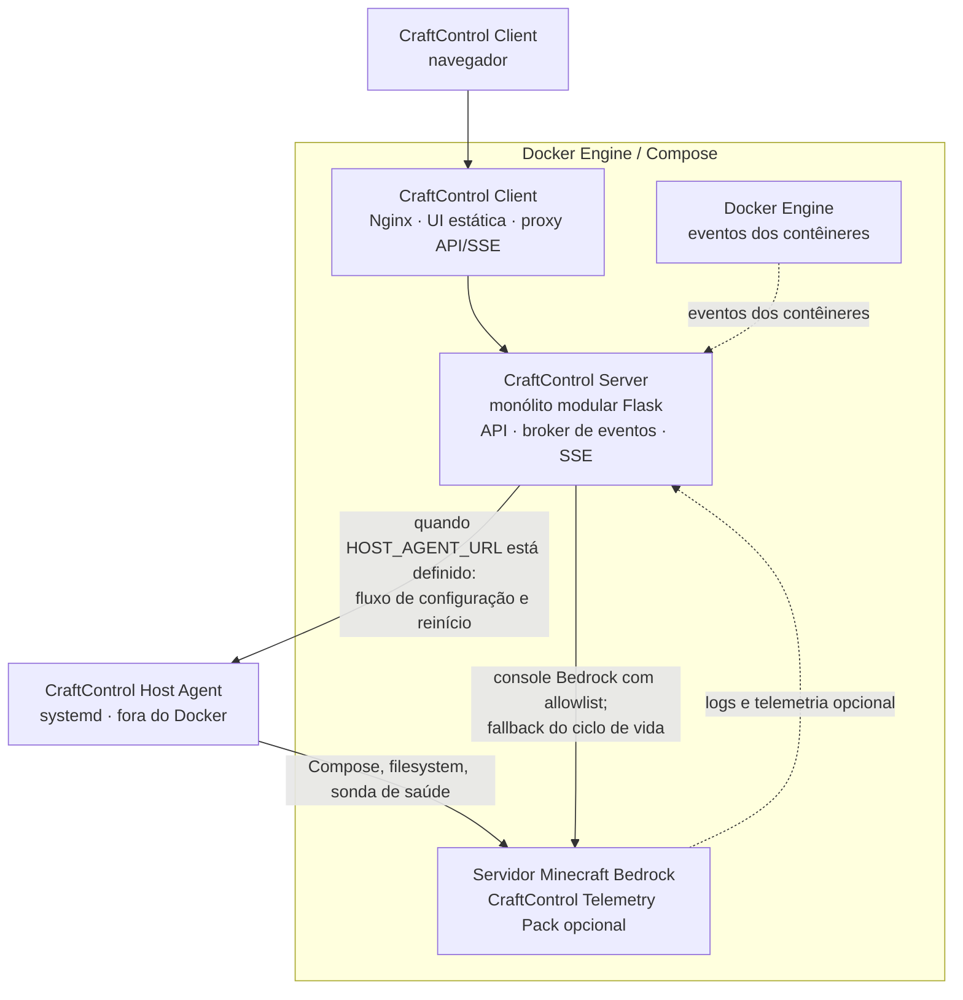
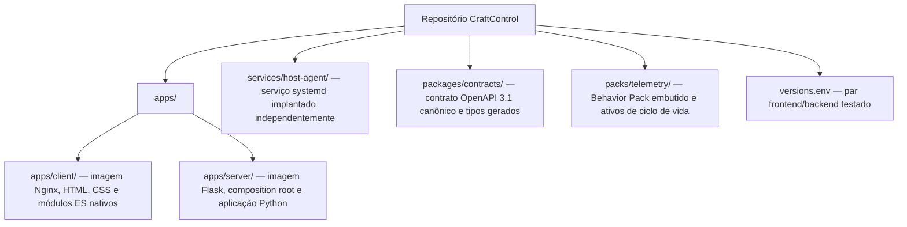
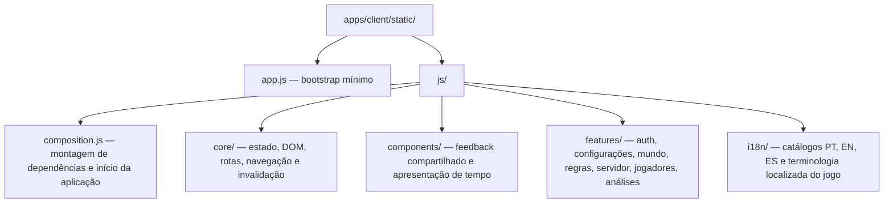
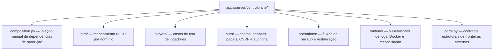
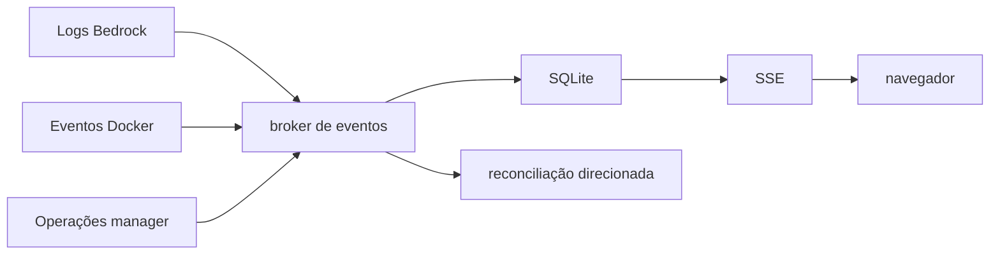

<div align="center">
  <p><a href="README.md">Read in English</a></p>
  
  <h1>CraftControl</h1>
  <p><strong>Um centro de controle mobile-first para servidores Minecraft Bedrock.</strong></p>
  <p>Administre mundos, jogadores, regras, acesso, backups e estatísticas estruturadas sem viver no console do servidor.</p>
  <p>
    <a href="https://github.com/dgaramos/craftcontrol/actions/workflows/quality.yml"></a>
    <a href="https://codecov.io/gh/dgaramos/craftcontrol"></a>
    <a href="LICENSE"></a>
    <a href="https://www.python.org/"></a>
    <a href="https://flask.palletsprojects.com/"></a>
    <a href="https://www.sqlite.org/"></a>
    <a href="https://www.docker.com/"></a>
  </p>
  <p>
    <a href="https://nginx.org/"></a>
    <a href="https://developer.mozilla.org/docs/Web/JavaScript"></a>
    <a href="packages/contracts/openapi.json"></a>
    <a href="#contratos-e-documentacao-da-api"></a>
    
  </p>
</div>

> [!IMPORTANT]
> O CraftControl destina-se a redes privadas confiáveis. A autenticação local e a proteção CSRF estão ativas, mas a terminação TLS e o acesso restrito ao Docker continuam sendo requisitos de implantação. Não exponha a porta `8082` diretamente à Internet.

## O que o CraftControl oferece

- Controles específicos para propriedades do servidor, gamerules, horário, clima, permissões, packs e ciclo de vida.
- Perfis permanentes com aliases, sessões, tempo de jogo, mortes, permissões e telemetria individual.
- Análises globais de atividade, mortes, rankings, blocos, combate, exploração e períodos de 7/30 dias.
- Um Behavior Pack complementar para abates, blocos, dano, distância, dimensões e mortes estruturadas autoritativos.
- Backups coordenados do mundo e SQLite com verificação, retenção, restauração offline e cópias de recuperação.
- Contas de proprietário, operador e visualizador vinculadas a jogadores, com sessões opacas e tokens CSRF vinculados à sessão.
- Interface responsiva em português, inglês e espanhol, com ícones pixel-art originais do CraftControl.

O CraftControl Server continua útil sem o CraftControl Telemetry Pack opcional, Prometheus, Grafana, Loki ou qualquer serviço externo de observabilidade.

## Interface

As seis áreas principais são orientadas por tarefa:

| Área | Responsabilidade |
| --- | --- |
| Início | Saúde do servidor, jogadores online, atualização e atalhos |
| Mundo | Identidade, geração, horário, clima e ciclos |
| Jogadores | Perfis, sessões, acesso, permissões e telemetria individual |
| Dados | Atividade, mortes, rankings, blocos, combate, exploração e períodos |
| Regras | Jogabilidade, interface, mobs, drops, comandos, fogo, TNT e regeneração |
| Servidor | CraftControl Telemetry Pack, rede, desempenho, backups e ciclo de vida do contêiner |

A navegação é codificada na URL; recarregar o navegador preserva a área ativa. Mudanças persistentes de configuração entram em uma gaveta de revisão; gamerules marcadas com raio são aplicadas imediatamente.

## Arquitetura

O CraftControl é um monorepo com dois serviços de aplicação em contêiner implantáveis de modo independente, não um conjunto de microsserviços. O backend continua sendo um monólito modular; um host agent systemd opcional é uma fronteira de execução separada no host.



O CraftControl Client é dono da origem pública. O Nginx serve ativos estáticos e encaminha `/api/*`, inclusive Server-Sent Events sem buffer, para o CraftControl Server privado. O Client não possui montagens persistentes ou privilegiadas. O Server é dono do estado durável (SQLite), arquivos Bedrock, backups coordenados, operações de console, streaming de logs e eventos Docker.

O CraftControl possui três fronteiras de execução: o **CraftControl Client** (contêiner Nginx servindo ativos estáticos e fazendo proxy da API), o **CraftControl Server** (monólito modular Flask dentro do Docker gerenciando estado, autenticação e operações Bedrock) e o **CraftControl Host Agent** (`craftcontrol-host-agent`, um serviço systemd rodando no host Docker fora de todos os contêineres).

Quando o CraftControl Host Agent está configurado (`HOST_AGENT_URL` definido), as operações de ciclo de vida do servidor — `PREPARATION` (escrita de configuração), `RESTART` (reinício do serviço Compose) e `HEALTH_WAIT` (sondagem UDP Bedrock) — são delegadas a ele por meio de um canal HTTP autenticado. O agente cuida do acesso ao socket Docker para essas três etapas, evitando que o CraftControl Server as execute diretamente; o socket Docker continua montado no Server para conexão ao console Bedrock, streaming de logs e eventos Docker, que não fazem parte do contrato do Host Agent. Sem o Host Agent, o Server executa todas as operações de ciclo de vida diretamente.

O host agent é intencionalmente **não** um contêiner Docker. Containerizá-lo exigiria montar o socket Docker dentro do contêiner (desfazendo o isolamento de menor privilégio) ou usar montagens de host privilegiadas com namespaces de rede elevados. Rodando como serviço systemd no host, o acesso ao socket Docker é obtido por meio de associação de grupo no nível do sistema operacional, sem expor o socket à rede de contêineres ou à imagem do backend.

O backend roda intencionalmente com um worker Gunicorn e várias threads. Seu broker de eventos, supervisores, lock de atualização e entrega SSE são locais ao processo; vários workers duplicariam essas responsabilidades.

### Propriedade do repositório



Os links Python da raiz e a imagem combinada são compatibility overlays. Eles preservam ferramentas existentes e rollback de emergência; código novo pertence a `apps/`.

### Módulos do frontend

O frontend usa módulos ES nativos do navegador, sem bundler ou framework em tempo de build.



As features possuem markup, bindings e estado local; o `core/` não importa `features/`. Veja [Arquitetura](docs/architecture.md) para regras de dependência, consistência de eventos, não-objetivos deliberados e layout-alvo incremental.

### Camadas do backend



Rotas traduzem HTTP; casos de uso coordenam comportamento; repositórios possuem a persistência. Veja [`apps/server/controlplane/README.md`](apps/server/controlplane/README.md) para o layout completo do pacote e regras de arquitetura.

### Contratos e documentação da API

`packages/contracts/openapi.json` é o contrato de negócio OpenAPI 3.1 canônico. Declarações geradas do Client ficam em `apps/client/static/js/api-contract.d.ts`; o portão de qualidade rejeita declarações desatualizadas.

Instalações autenticadas expõem:

- `/api/openapi.json` — contrato legível por máquina;
- `/api/docs` — Swagger UI usando a sessão atual;
- `/api/events` — Server-Sent Events persistidos e ao vivo.
- `/api/diagnostics` — diagnósticos locais de telemetria e SSE para owners; não exige uma stack de observabilidade.

Os diagnósticos de persistência reportam espera de conexão SQLite, pressão de
tentativas limitadas, falhas finais de contenção e tamanho do banco sem expor
conteúdo ou caminhos do sistema de arquivos. Somente leituras idempotentes
podem tentar novamente após contenção transitória do SQLite; escritas falham
sem nova tentativa automática.

`GET /api/operations` retorna histórico de operações limitado e paginado pelo parâmetro `page`, baseado em 1, e pelo tamanho de página `limit`, de 1 a 100 (padrão 10).

O Swagger anexa o token CSRF vinculado à sessão a requisições inseguras de “Try it out” e nunca ignora capabilities de papel. Não há endpoint arbitrário de shell ou console.

## Estado e telemetria orientados por eventos

O CraftControl acompanha logs do Bedrock e eventos de ciclo de vida do Docker, confirma evidências duráveis no SQLite, publica mudanças por SSE, faz atualizações direcionadas e executa uma reconciliação de segurança completa a cada 15 minutos por padrão. Informações obsoletas permanecem visíveis e marcadas em vez de serem substituídas por valores vazios falsos.



O CraftControl Telemetry Pack opcional (`0.4.0`) emite JSON versionado por schema e suporta snapshots autoritativos e eventos incrementais. Snapshots podem recuperar agregados de toda a vida após indisponibilidade; não podem recriar cada evento perdido, timestamp, causa ou coordenada.

Veja [Arquitetura](docs/architecture.md) para o modelo de eventos e consistência, e [Integração do CraftControl Telemetry Pack](docs/telemetry-pack.md) para o ciclo de vida e o runbook de recuperação.

## Instalação

O CraftControl requer Docker Engine com o plugin Compose e uma implantação
existente de `itzg/minecraft-bedrock-server`. Ele roda ao lado do projeto
Bedrock e deve ser implantado pelos comandos protegidos. Nunca execute
`docker compose up` sem opções a partir de um checkout de desenvolvimento. Releases coordenadas preparam as duas imagens versionadas antes de recriar qualquer serviço e tentam realizar o build das imagens até três vezes.

Veja [Instalação](docs/installation.pt-BR.md) para pré-requisitos, layout esperado,
configuração, cutover, acesso, verificações pós-instalação e solução de problemas.

## Configuração

O CraftControl é configurado por variáveis de ambiente (`MANAGER_PORT`, `MINECRAFT_CONTAINER`, `DATABASE_PATH`, `HOST_AGENT_URL`, `TZ` e outras) e lê `versions.env` para o par frontend/backend testado.

Veja [Configuração](docs/configuration.md) para a referência completa de variáveis, regras de autoridade de configuração Bedrock e configurações de timeout do host agent.

## Autenticação e acesso

Contas do painel se vinculam a jogadores que o Bedrock já observou. Três papéis — Visualizador, Operador e Proprietário — controlam o acesso a configurações, comandos de ciclo de vida e gerenciamento de usuários. Permissão Minecraft e papel do CraftControl são independentes.

Gere o primeiro código único de proprietário após esse jogador entrar no Bedrock:

```bash
docker compose -f docker-compose.split.yml exec craftcontrol-backend \
  craftcontrol auth bootstrap --player VonCrush
```

Veja [Autenticação e autorização locais](docs/authentication.md) para a matriz completa de capabilities, fluxo de convites, política de sessão e detalhes de CSRF.

## Dados de jogadores e análises

O SQLite armazena perfis permanentes, aliases, presença, sessões, tempo de jogo acumulado, permissões, mortes, histórico de eventos e telemetria estruturada opcional. Desconectar um jogador fecha ou infere a sessão; nunca exclui o perfil.

A área Jogadores consolida totais e detalhamentos de toda a vida antes das evidências recentes: abates por criatura, blocos por tipo, exploração por dimensão, sessões, mortes e histórico técnico. A área Dados oferece visões filtradas e paginadas de todo o servidor. Mortes estruturadas e derivadas são deduplicadas para exibição, enquanto a evidência bruta permanece privada.

Ícones de criaturas, blocos, projéteis, navegação, ações, estados e métricas usam pixel art SVG original incluída. Identificadores do jogo são localizados em português, inglês e espanhol, com fallback neutro localizado para identificadores desconhecidos. Veja [Regras do sistema visual](docs/design-system.md).

## Backups e recuperação

O CraftControl não é dono do mundo Minecraft. O mundo permanece no projeto Bedrock; o estado do gerenciador vive em `manager.db`. Migrações SQLite são transacionais e criam um backup imutável do banco antes da primeira migração pendente.

Use comandos coordenados em vez de copiar um banco ou mundo em execução:

```bash
docker compose -f docker-compose.split.yml exec craftcontrol-backend craftcontrol backup create
docker compose -f docker-compose.split.yml exec craftcontrol-backend craftcontrol backup list
docker compose -f docker-compose.split.yml exec craftcontrol-backend craftcontrol backup verify BACKUP_ID
```

Quando o Bedrock está em execução, o serviço de backup mantém os saves somente durante a janela de cópia e os retoma mesmo após falha. Conjuntos de recuperação incluem mundo, banco SQLite, configuração do servidor, allowlists, permissões, arquivos do Behavior Pack, checksums e manifesto versionado. A restauração é deliberadamente offline e cria uma cópia de recuperação pré-restauração.

Veja [Backup e restauração coordenados](docs/backup-and-restore.md) e [Migrações de banco de dados](docs/database-migrations.md).

## Releases independentes e rollback

`versions.env` fixa o par frontend/backend testado. Implante ambos ou somente o componente alterado:

```bash
bin/deploy-craftcontrol-release --check
bin/deploy-craftcontrol-release

bin/deploy-craftcontrol-frontend
bin/deploy-craftcontrol-backend

bin/deploy-craftcontrol-frontend --rollback VERSION
bin/deploy-craftcontrol-backend --rollback VERSION
bin/deploy-craftcontrol-release --rollback FRONTEND_VERSION BACKEND_VERSION
```

A implantação do frontend prova que o contêiner do backend não foi alterado. A implantação do backend cria e verifica um backup coordenado, confere SQLite e montagens persistentes e prova que o contêiner frontend não foi recriado. `bin/cutover-craftcontrol-split` realiza o cutover dividido único e mantém a imagem combinada como caminho explícito de compatibilidade de emergência.

A interface lê `/version.json` do frontend e metadados de release do backend, mantendo a ativação da imagem separada da instalação do Behavior Pack e timestamps de resposta de runtime.

## Desenvolvimento e portões de qualidade

O CraftControl usa Python 3.12, Flask, Gunicorn, SQLite, Docker SDK para Python, Nginx e JavaScript do navegador sem dependências. GitHub Actions e Gitea Actions executam seis portões de qualidade de modo independente; execuções bem-sucedidas no `main` do Gitea implantam automaticamente pelo runner homelab do repositório.

Veja [Contribuição](CONTRIBUTING.md) para os comandos do portão de qualidade (`bin/check` e seus portões independentes), convenções de commit e fluxo de PR. Veja [`apps/server/controlplane/README.md`](apps/server/controlplane/README.md) para o layout do pacote backend e referência de infraestrutura de testes. Veja [Configuração de desenvolvimento](docs/development-setup.md) para pré-requisitos, configuração de ambiente e tarefas comuns.

## Estado da segurança

As proteções atuais incluem contas locais vinculadas a jogadores, capabilities de papel, credenciais únicas com hash, sessões opacas revogáveis, limitação de login, registros de auditoria de segurança, CSRF vinculado à sessão, validação de origem, allowlists estritas de comandos, validação de entrada, escritas atômicas de configuração, XUIDs ocultos e `no-new-privileges`.

Trabalho de fortalecimento restante:

1. substituir o acesso direto ao socket Docker por um gateway de operações restrito;
2. documentar e automatizar uma fronteira TLS/proxy reverso suportada;
3. continuar removendo overlays de compatibilidade após janelas de migração testadas;
4. ampliar instalação comunitária, diagnósticos e automação de releases.

Para o modelo completo de ameaças, proteções atuais e roadmap de fortalecimento, veja [docs/security.md](docs/security.md). Para reportar uma vulnerabilidade privadamente veja [SECURITY.md](SECURITY.md).

## Contribuição

Veja [CONTRIBUTING.md](CONTRIBUTING.md) para nomes de branch, formato de título de PR, requisitos de metadados, Conventional Commits, portão de qualidade e interação com CodeRabbit.

### Skills do Codex

Se você usa Codex, instale o plugin global de workflows portáteis `cody-dr`
para criação e execução de issues, revisões e tratamento de findings. O
CraftControl não sombreia essas skills de ciclo de vida localmente; o plugin
descobre o perfil compartilhado do projeto automaticamente.

| Skill | Quando usar |
|---|---|
| `backend` | Padrões Python: DI, Protocols, `is None`, composition root e fakes |
| `frontend` | Padrões JS: injeção de deps, ESM, i18n e testes |
| `manage-project` | Gerencia issues nos GitHub Project boards |
| `manage-milestone` | Gerencia milestones e audita backlog |

As skills locais complementam o plugin: o Codex continua seguindo `AGENTS.md` e as instruções de segurança. Um pedido para executar uma issue até o PR (inclusive via link) autoriza branch, commit, push e abertura do PR; merge e deploy continuam exigindo pedido explícito.

O perfil tool-neutral em [`.dr-agents/craftcontrol/PROFILE.md`](.dr-agents/craftcontrol/PROFILE.md)
concentra as salvaguardas específicas das revisões Cody DR e Claudio DR. Qualquer
agente pode seguir o perfil local ao receber o caminho; ele complementa skills
genéricas e não dispara uma revisão sozinho.

## Licença e marcas

Copyright 2026 Danilo Ramos.

CraftControl é licenciado sob a [Licença Apache 2.0](LICENSE). A licença se aplica ao código-fonte original do CraftControl, documentação, Telemetry Pack e ativos visuais deste repositório, salvo quando um arquivo declarar o contrário.

CraftControl é independente e não é afiliado à Mojang Studios ou Microsoft. Minecraft é uma marca comercial da Microsoft Corporation.
