# controlplane

Python application package for CraftControl — a Minecraft Bedrock server manager
designed for trusted homelab LAN environments.

Currently lives inside the `apps/server/` subtree of the CraftControl monorepo.
Every architectural decision here is made so the package can be extracted into its
own repository without structural changes.

---

## Package layout

```text
controlplane/
├── __init__.py          # create_app() factory, frontend_root() helper
├── composition.py       # manual production dependency injection (no DI container)
├── ports.py             # structural Protocols at replaceable boundaries
├── cli.py               # management CLI entry point
├── version.py           # package version metadata
│
├── core/                # cross-cutting infrastructure
│   ├── config.py        # Settings — environment-driven configuration
│   ├── events.py        # EventBroker — in-process pub/sub
│   ├── repository.py    # StateRepository — SQLite-backed state store
│   ├── migrations.py    # incremental schema migrations
│   └── validation.py    # shared input validators
│
├── server/              # Bedrock, Docker, Host Agent, and file adapters
│   ├── bedrock.py       # BedrockAdapter — log parsing, command dispatch
│   ├── docker.py        # DockerAdapter — container lifecycle
│   ├── host_agent.py    # HostAgentAdapter — HTTP calls to the host-agent sidecar
│   ├── files.py         # ServerFiles — .env and server.properties access
│   └── world.py         # WorldService — world-level operations
│
├── players/             # player identity and session tracking
│   ├── service.py       # PlayerService
│   ├── repository.py    # SQLite player persistence
│   └── sqlite.py        # low-level player SQLite helpers
│
├── telemetry/           # behavior-pack event ingestion and domain freshness
│   ├── service.py       # TelemetryService
│   └── repository.py    # SQLiteTelemetryRepository
│
├── operations/          # backup, restore, and operational workflows
│   ├── lifecycle.py     # ServerOperation state machine
│   ├── service.py       # OperationService
│   └── repository.py    # SQLite operation persistence
│
├── runtime/             # supervisors, reconciliation, and state assembly
│   ├── manager.py       # ManagerService — top-level service facade
│   └── reconciliation.py# ReconciliationService — background state refresh
│
├── http/                # Flask blueprints and request mapping
│   ├── __init__.py      # blueprint aggregation
│   └── handlers.py      # route handlers
│
├── auth/                # player-backed local authentication
│   ├── service.py       # AuthService
│   └── http.py          # auth blueprint and middleware
│
└── audit/               # durable security event records
    ├── model.py
    ├── repository.py
    └── service.py
```

---

See [Architecture](../../docs/architecture.md) for dependency direction rules, constructor injection policy, Protocol-based boundaries, and the event and consistency model.

---

## Database schema

All persistent state lives in a single SQLite file. The default path is
`data/manager.db`; it is controlled by `Settings.database` and can be
overridden via the `DATABASE` environment variable. Schema migrations run
automatically at startup via `core/migrations.py`.

```mermaid
erDiagram
    state {
        TEXT kind PK
        TEXT key PK
        TEXT value
        REAL updated_at
        TEXT source
        REAL changed_at
    }

    events {
        INTEGER id PK
        TEXT topic
        TEXT source
        TEXT payload
        REAL occurred_at
    }

    player_profiles {
        TEXT identity PK
        TEXT xuid UK
        TEXT name
        REAL first_seen_at
        REAL last_seen_at
        TEXT stats
    }

    player_aliases {
        TEXT identity PK
        TEXT name PK
        REAL first_seen_at
        REAL last_seen_at
    }

    player_sessions {
        INTEGER id PK
        TEXT identity
        REAL connected_at
        REAL disconnected_at
        TEXT reason
    }

    player_history {
        INTEGER id PK
        TEXT identity
        TEXT event_type
        REAL occurred_at
        TEXT payload
        TEXT event_key UK
    }

    player_telemetry {
        TEXT identity PK
        TEXT stats
        REAL updated_at
    }

    player_daily {
        TEXT identity PK
        TEXT day PK
        INTEGER blocks_broken
        INTEGER blocks_placed
        INTEGER deaths
        INTEGER kills
        INTEGER distance_walked
        INTEGER dimension_transitions
        REAL updated_at
    }

    telemetry_events {
        TEXT event_key PK
        INTEGER sequence
        TEXT event_type
        TEXT player_name
        TEXT payload
        REAL received_at
    }

    panel_accounts {
        TEXT identity PK
        TEXT role
        TEXT password_hash
        REAL created_at
    }

    panel_invitations {
        TEXT token_hash PK
        TEXT identity
        TEXT role
        REAL created_at
        REAL used_at
    }

    panel_sessions {
        TEXT token_hash PK
        TEXT identity
        REAL created_at
        REAL last_seen_at
    }

    auth_attempts {
        INTEGER id PK
        TEXT login_key
        REAL occurred_at
        INTEGER success
    }

    audit_log {
        INTEGER id PK
        REAL occurred_at
        TEXT actor_identity
        TEXT action
        TEXT target
        TEXT payload
    }

    server_operations {
        TEXT operation_id PK
        TEXT server_id
        TEXT state
        TEXT payload
        REAL created_at
        REAL updated_at
    }

    operation_stages {
        TEXT operation_id PK
        TEXT stage PK
        TEXT result
        TEXT evidence
        REAL started_at
        REAL finished_at
    }

    player_profiles ||--o{ player_aliases : "identity"
    player_profiles ||--o{ player_sessions : "identity"
    player_profiles ||--o{ player_history : "identity"
    player_profiles ||--o| player_telemetry : "identity"
    player_profiles ||--o{ player_daily : "identity"
    panel_accounts ||--o{ panel_invitations : "identity"
    panel_accounts ||--o{ panel_sessions : "identity"
    panel_accounts ||--o{ audit_log : "actor_identity"
    server_operations ||--o{ operation_stages : "operation_id"
```



**Groups by domain:**

| Tables | Domain |
|---|---|
| `state`, `events` | Core state store and event log |
| `player_profiles`, `player_aliases`, `player_sessions`, `player_history`, `player_telemetry`, `player_daily` | Player identity and analytics |
| `telemetry_events` | Behavior-pack event ingestion |
| `panel_accounts`, `panel_invitations`, `panel_sessions`, `auth_attempts` | Authentication |
| `audit_log` | Security audit trail |
| `server_operations`, `operation_stages` | Lifecycle operations |

---

## Testing

Tests live in `apps/server/tests/` and mirror this package layout:

| Module | Test directory |
|---|---|
| `core/` | `tests/core/` |
| `server/` | `tests/server/` |
| `players/` | `tests/players/` |
| `telemetry/` | `tests/telemetry/` |
| `operations/` | `tests/operations/` |
| `runtime/` | `tests/runtime/` |
| `http/` | `tests/http/` |
| `audit/` | `tests/audit/` |
| `auth/` | `tests/auth/` |

Cross-cutting tests (architecture invariants, composition, CLI, config, brand) stay
at the `tests/` root.

### Shared test infrastructure

| File | Purpose |
|---|---|
| `tests/fakes.py` | Injectable fakes that replace production adapters (e.g. `FakeBedrock`, `FakeDocker`) |
| `tests/factories.py` | Builder functions for domain objects and protocol payloads (e.g. `telemetry_envelope()`, `player_snapshot()`) |
| `tests/conftest.py` | Pytest fixtures shared across the whole suite (e.g. `tmp_db`, `broker`, `operation_service`) |

Never inline test helpers in a single test module. Add them to the right shared
file so future tests can reuse them.

### Using factories

`tests/factories.py` contains builder functions for test data. Each function
returns a well-formed dict with sensible defaults so tests only specify the
fields that matter for the scenario:

```python
from factories import telemetry_envelope, player_snapshot

# minimal — all defaults
env = telemetry_envelope()

# only override what the test cares about
env = telemetry_envelope(event_type="player.died", player="VonCrush")

# server-level event — no player context
env = telemetry_envelope(event_type="server.started", player=None)

# player snapshot
snap = player_snapshot(name="VonCrush", online=False)
```

Add a new factory function whenever a test constructs the same dict shape more
than once. Keep defaults realistic so the factory is useful on its own.

### Constructor injection over patching

Design production code so collaborators arrive as constructor parameters.
Tests pass fakes or `MagicMock` instances directly. Never use
`unittest.mock.patch` on stdlib modules (`pathlib.Path`, `subprocess`, `sqlite3`).

### Capability assertions

When testing that a route is protected, assert the *exact* capability name the
handler checks — not just that a 403 is returned. Use `assert_capability_required`
in `tests/http/test_http_handlers.py` as the model.

---

## Running tests

From `apps/server/`:

```bash
# Full backend gate (includes coverage and architecture checks)
../../bin/check-backend

# Fast subset
pytest tests/ -x -q
```

Requirements: Python 3.12+, dependencies from `requirements.txt`.

---

## Extracting to a standalone repository

If this package is ever extracted:

1. Copy `apps/server/controlplane/` as the package root.
2. Copy `apps/server/tests/` as the test root.
3. Copy `apps/server/requirements.txt` and `apps/server/Dockerfile`.
4. The `apps/client/` frontend and host-agent remain separate packages.
5. Update `frontend_root()` in `__init__.py` — the monorepo path branch can be removed.
6. All import paths (`from controlplane.*`) are already stable and require no changes.
