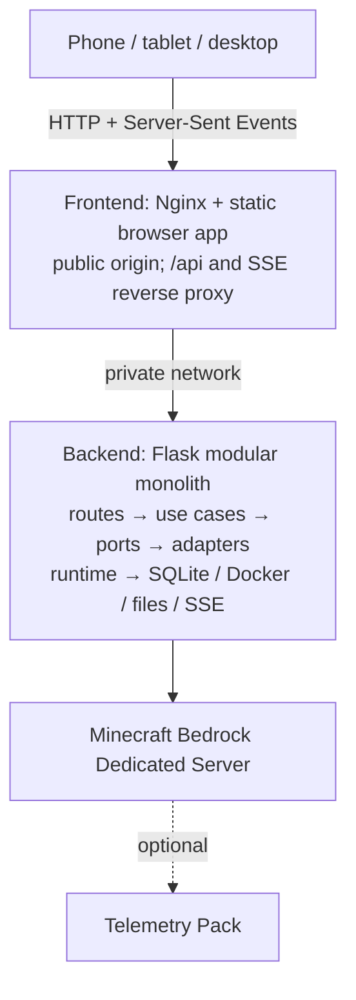
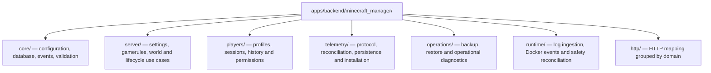
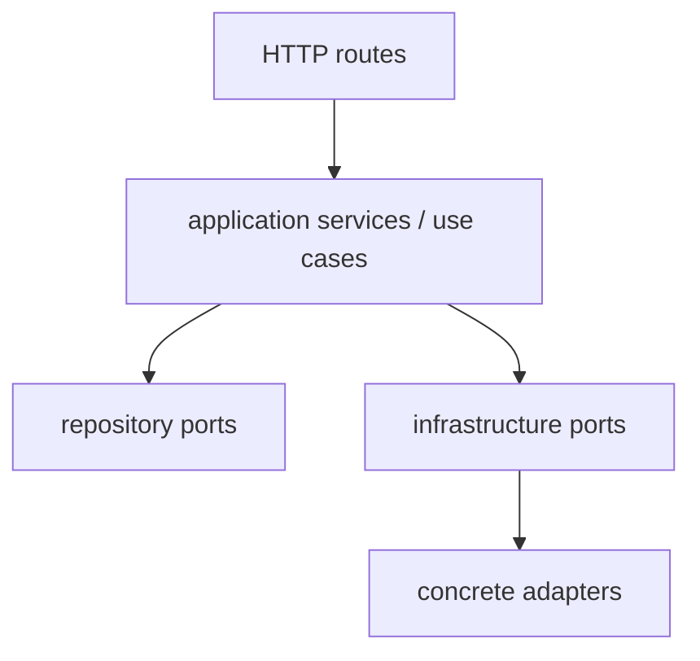
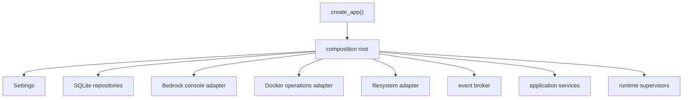
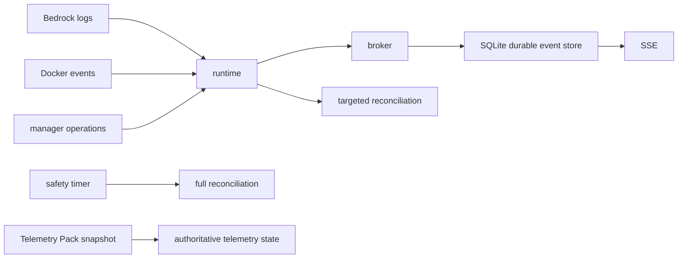

# CraftControl Architecture

CraftControl has a modular-monolith backend for operating one Minecraft Bedrock Dedicated Server and an independently deployable browser frontend. The two services share one public origin through a private same-origin proxy boundary.

## Current system context

The manager remains operational without the Telemetry Pack, exporter, Prometheus, Grafana, or Loki. SQLite stores durable manager state; the Minecraft world remains owned by the Bedrock deployment.

## Architectural style

The primary style is a **modular monolith with layered use cases**. External boundaries use **ports and adapters**, while state synchronization is **event-driven**.

CraftControl is not strict MVC. Routes and browser views resemble controllers and views, but application services, event supervisors, reconciliation, and infrastructure adapters are first-class components outside classic MVC.

CraftControl is not a strict textbook Clean Architecture implementation. It applies the useful dependency rules without requiring an interface for every class or adding abstraction that has no practical replacement or test seam.

## Target modules

Migration to this shape is incremental. `apps/frontend/` and `apps/backend/`
are now explicit code boundaries, while root Python entry points and package
links temporarily preserve local tooling. Existing public APIs, database
tables, environment variables, world data, and deployment paths remain
compatible during refactoring.

The split-image production topology turns those source boundaries into two runtime images.
The frontend is a stateless Nginx origin and `/api/*` proxy; the backend remains
one modular-monolith process and is the only service allowed to access durable
state or privileged infrastructure. Each image has an independent version,
deploy command, health check, and rollback target; `versions.env` pins a tested
compatibility pair.

## Dependency direction

Rules:

1. Routes translate HTTP requests and responses; they do not issue SQL, Docker operations, console commands, or file writes.
2. Application services coordinate use cases and depend on ports when a boundary needs substitution or isolated testing.
3. Repositories own persistence behavior. Domain services do not depend on SQLite details.
4. Adapters isolate Bedrock console, Docker, and filesystem behavior.
5. Runtime supervisors call application-facing methods; they do not reach through a service to its repository.
6. Cross-domain asynchronous changes use the internal event broker. Direct calls remain valid when an immediate result is required.
7. Browser code consumes the public API and does not duplicate security-critical validation.
8. Telemetry is always an optional enhancement; snapshots are authoritative and incremental events provide low-latency updates.

The versioned OpenAPI 3.1 document under `packages/contracts/` is the canonical
business HTTP contract. Its authenticated Swagger interface runs inside the
backend boundary, uses same-origin session cookies, and sends the session-bound
CSRF token for unsafe operations. The route inventory remains an independent
migration guard until the two deployment units are complete.

## Dependency injection

Dependency injection uses constructor parameters and a manual **composition root**. Python `typing.Protocol` defines only meaningful ports: external infrastructure, persistence contracts, and event publication. Concrete services do not receive redundant `IService` interfaces solely for symmetry.

Production composition uses concrete adapters. Tests may inject in-memory repositories, fake clocks, fake consoles, or fake container operations without Docker or a running Bedrock server.

No dependency-injection framework or service locator is used. Dependencies must remain visible in constructors or composition functions.

## Event and consistency model

Cached values keep observation and change timestamps. Missing signals cause stale or degraded state, not invented zero values. Full reconciliation runs after manager startup, relevant stream recovery, manual refresh, and the configured safety interval.

The process currently runs one Gunicorn worker because the broker, runtime supervisors, refresh locks, and SSE subscribers are process-local. Multiple workers require redesigning those facilities around shared coordination.

## Deliberate non-goals

- No microservice split for individual backend domains; the frontend/backend
  deployment boundary does not fragment backend use cases.
- No external message broker while process-local delivery is sufficient.
- No ORM solely to replace small, explicit SQLite queries.
- No frontend framework or build pipeline until native browser modules stop meeting product needs.
- No coupling to the observability exporter.

## Evolution sequence

1. Establish ports and a composition root without changing behavior.
2. Extract telemetry and player use cases and repositories from the legacy facades.
3. Group HTTP routes by domain while preserving URLs.
4. Split browser JavaScript and CSS by screen and shared responsibility.
5. Complete coordinated backup, export, retention, and restore as the final reliability foundation step.
6. Build authentication, CSRF protection, and analytics on the resulting module boundaries.

Every step must retain compatibility, add or update tests, and pass the project quality gate before deployment.
