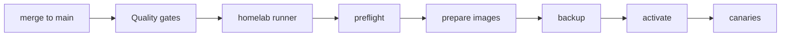

# Automated homelab deployment

CraftControl deploys a successful `main` revision automatically after the
GitHub `Quality gates` workflow finishes. The deployment job runs on the
repository-scoped `craftcontrol-homelab` self-hosted runner inside the homelab;
GitHub-hosted runners never receive Docker or LAN access.

The workflow checks out the exact accepted GitHub commit and asks the runner's
local deployment agent to run the guarded coordinated deployment:

The preflight and deployment use `bin/deploy-craftcontrol-release`. They retain
the existing guarantees: clean and published GitHub source, validated production
mounts, a verified coordinated backup before backend replacement, SQLite
integrity checks, frontend/backend health checks, anonymous-authentication
canary, and Bedrock health verification.

## Runner configuration

The runner is intentionally repository-scoped and has the `homelab` and
`craftcontrol` labels. It needs Docker-socket and `/mnt/storage/docker` access
because the guarded deployment command operates the local production Compose
project. Do not attach these labels to a shared runner or use it for pull
requests from untrusted repositories.

The runner Compose project lives at
`/mnt/storage/docker/craftcontrol-github-runner`. Its registration token is
short-lived and is used only for initial runner registration; persistent runner
state and the local deployment agent remain outside this repository.

## Failure behavior

Deployments are serialized with the `craftcontrol-homelab-production`
concurrency group. A failed quality workflow never starts a deployment. A
guarded release builds both images before recreating either service. Each image
build is retried up to three times for transient registry or DNS failures; if
preparation still fails, no service is recreated. A failure after activation
exits with the existing canary failure and preserves the verified backup for
explicit rollback using
`bin/deploy-craftcontrol-release --rollback FRONTEND_VERSION BACKEND_VERSION`.
