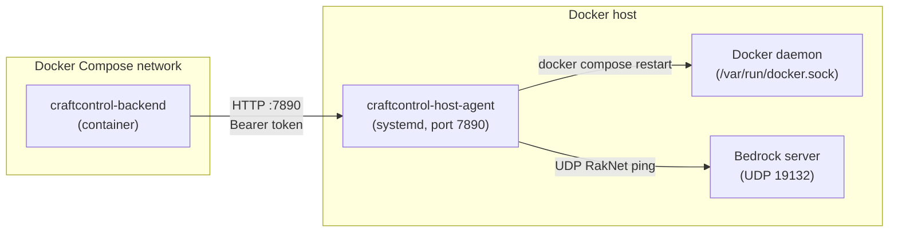

# Host Agent Installation Guide

This guide describes how to install and configure the CraftControl host agent
on a Docker host running the split deployment topology. Read
`docs/host-agent-contract.md` for the full inter-process design contract and
`docs/deployment-split.md` for the split topology architecture.

---

## Overview

The host agent runs as a systemd service **outside all containers**. It
accepts authenticated HTTP requests from the CraftControl backend and executes
exactly the permitted host-level operations: writing Bedrock configuration
files, issuing a `docker compose restart`, and polling the Bedrock UDP health
probe.

When the host agent is active, the backend container no longer needs a Docker
socket mount. The socket is managed entirely on the host side.



---

## Prerequisites

- A Linux host running systemd.
- Docker and `docker compose` (v2) installed and running.
- Python 3.10 or later available at `/usr/bin/python3`.
- The CraftControl repository checked out at `/opt/craftcontrol/` (or the path
  you configure via environment variables).

---

## Step 1 — Create the OS user

```bash
sudo useradd --system --no-create-home --shell /usr/sbin/nologin craftcontrol-agent
sudo usermod -aG docker craftcontrol-agent
```

The `craftcontrol-agent` user needs Docker socket access through group
membership. It does not need a login shell or a home directory.

---

## Step 2 — Install the agent

```bash
sudo mkdir -p /opt/craftcontrol/host-agent
sudo cp deploy/host-agent/agent.py /opt/craftcontrol/host-agent/agent.py
sudo chown craftcontrol-agent:craftcontrol-agent /opt/craftcontrol/host-agent/agent.py
sudo chmod 0755 /opt/craftcontrol/host-agent/agent.py
```

The agent uses only the Python standard library. No additional packages are
required for production.

---

## Step 3 — Provision the shared secret

Generate a token of at least 32 URL-safe base64 characters (256 bits):

```bash
TOKEN=$(python3 -c "import secrets; print(secrets.token_urlsafe(32), end='')")
```

Write it to the host secret file, owned by the agent user and readable only by
that user:

```bash
sudo mkdir -p /etc/craftcontrol
echo -n "$TOKEN" | sudo install -m 0600 \
  -o craftcontrol-agent -g craftcontrol-agent \
  /dev/stdin /etc/craftcontrol/host-agent-token
```

Write the same token to a file the backend container can read. In the split
Compose topology, mount it as a read-only bind volume:

```yaml
volumes:
  - /etc/craftcontrol/host-agent-token:/run/host-agent-token:ro
```

Set `HOST_AGENT_TOKEN_FILE=/run/host-agent-token` in the backend environment
(or in `.env`).

---

## Step 4 — Configure the firewall

The agent binds to `0.0.0.0:7890` by default because `127.0.0.1` is not
reachable from Docker bridge containers even when `host-gateway` is configured.
Restrict inbound connections on port 7890 to the Docker bridge subnet only:

```bash
# Allow the Docker bridge subnet (adjust for your bridge, e.g. 172.17.0.0/16)
sudo ufw allow from 172.17.0.0/16 to any port 7890
# Or with iptables:
sudo iptables -A INPUT -p tcp --dport 7890 -s 172.17.0.0/16 -j ACCEPT
sudo iptables -A INPUT -p tcp --dport 7890 -j DROP
```

Verify the bridge subnet with:

```bash
docker network inspect bridge --format '{{range .IPAM.Config}}{{.Subnet}}{{end}}'
```

---

## Step 5 — Install the systemd unit

```bash
sudo cp deploy/host-agent/systemd/craftcontrol-host-agent.service \
  /etc/systemd/system/craftcontrol-host-agent.service
sudo systemctl daemon-reload
sudo systemctl enable craftcontrol-host-agent
sudo systemctl start craftcontrol-host-agent
```

Verify the service is running:

```bash
sudo systemctl status craftcontrol-host-agent
curl -s http://127.0.0.1:7890/v1/health
# Expected: {"status": "ok", "version": "0.1.0"}
```

---

## Step 6 — Override defaults (optional)

Create `/etc/craftcontrol/host-agent.env` to override any environment variable
without modifying the unit file:

```ini
HOST_AGENT_BIND=0.0.0.0:7890
HOST_AGENT_SECRET_FILE=/etc/craftcontrol/host-agent-token
HOST_AGENT_COMPOSE_PROJECT=minecraft-bedrock
HOST_AGENT_COMPOSE_FILE=/opt/craftcontrol/docker-compose.yml
HOST_AGENT_BEDROCK_DATA=/opt/craftcontrol/data/bedrock
```

If you override `HOST_AGENT_BEDROCK_DATA`, add a matching `ReadWritePaths=`
line in a systemd drop-in so `ProtectSystem=strict` does not block the write:

```bash
sudo mkdir -p /etc/systemd/system/craftcontrol-host-agent.service.d
cat <<EOF | sudo tee /etc/systemd/system/craftcontrol-host-agent.service.d/paths.conf
[Service]
ReadWritePaths=/your/custom/bedrock/data
EOF
sudo systemctl daemon-reload
sudo systemctl restart craftcontrol-host-agent
```

---

## Step 7 — Configure the backend

In `docker-compose.split.yml`, set the host-agent URL and token file path, and
remove the Docker socket mount:

```yaml
services:
  craftcontrol-backend:
    environment:
      HOST_AGENT_URL: "http://host-gateway:7890"
      HOST_AGENT_TOKEN_FILE: "/run/host-agent-token"
    extra_hosts:
      - "host-gateway:host-gateway"
    volumes:
      - /etc/craftcontrol/host-agent-token:/run/host-agent-token:ro
      - ../minecraft-bedrock:/minecraft-project
      - ./data:/data
      # Docker socket is no longer needed when HOST_AGENT_URL is set.
```

The `host-gateway` special value resolves to the Docker host IP at container
startup. The backend reaches the agent through that address on port 7890.

---

## Token rotation

Rotation is a coordinated maintenance window — plan for a brief 401 outage
between steps 3 and 4 while the host agent carries the new token but the
backend container still holds the old one. No requests will succeed during
that interval.

1. Generate a new token and write it to `/etc/craftcontrol/host-agent-token`.
2. Update the backend secret source (bind mount or Docker secret) so the new
   token file is ready before the backend restarts.
3. Restart the host agent: `sudo systemctl restart craftcontrol-host-agent`.
   The agent now accepts only the new token. All backend requests return 401
   until step 4 completes.
4. Restart the CraftControl backend: `bin/deploy-craftcontrol`. The backend
   reads the new token from the volume and resumes authenticated requests.

---

## Verifying connectivity

From the Docker host:

```bash
curl -s http://127.0.0.1:7890/v1/health
```

From inside the backend container:

```bash
docker exec craftcontrol-backend \
  python3 -c "import urllib.request; print(urllib.request.urlopen('http://host-gateway:7890/v1/health').read())"
```

Both should return `{"status": "ok", "version": "0.1.0"}`.

---

## Troubleshooting

| Symptom | Check |
|---------|-------|
| `Connection refused` on port 7890 | `systemctl status craftcontrol-host-agent` — agent may have failed to start |
| `401 Unauthorized` | Token mismatch — verify both sides read the same file |
| `Cannot read secret file` in logs | File permissions — must be readable by `craftcontrol-agent` |
| `docker compose restart` fails | `craftcontrol-agent` may not be in the `docker` group — run `groups craftcontrol-agent` |
| Agent does not restart after reboot | `systemctl is-enabled craftcontrol-host-agent` — run `systemctl enable` if disabled |
