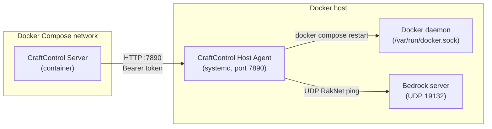

# Host Agent Installation Guide

This guide describes how to install and configure the **CraftControl Host Agent**
on a Docker host running the split deployment topology. Read
`docs/host-agent-contract.md` for the full inter-process design contract and
`docs/deployment-split.md` for the split topology architecture.

---

## Overview

The CraftControl Host Agent runs as a systemd service **outside all containers**. It
accepts authenticated HTTP requests from the CraftControl Server and executes
exactly the permitted host-level operations: writing Bedrock configuration
files, issuing a `docker compose restart`, and polling the Bedrock UDP health
probe.

When the Host Agent is active, server lifecycle operations (PREPARATION,
RESTART, HEALTH_WAIT) are delegated to the agent rather than executed directly
from within the Server container. The Server still mounts the Docker socket
for Bedrock console attachment, log streaming, and Docker events — operations
that are not part of the host-agent contract.

The host agent is intentionally **not** a Docker container. Containerizing it
would require either mounting the Docker socket into the container (defeating
least-privilege isolation) or using privileged host mounts with elevated network
namespaces. Running it as a systemd service on the host gives Docker socket
access through OS-level group membership without exposing the socket to the
container network or the backend image.

The agent source lives under `services/host-agent/` in the repository. The
systemd unit file is under `deploy/host-agent/systemd/`.



---

## Prerequisites

- A Linux host running systemd.
- Docker and `docker compose` (v2) installed and running.
- Python 3.10 or later available at `/usr/bin/python3`.
- The CraftControl repository checked out at `/opt/craftcontrol/` (or the path
  you configure via environment variables).

---

## Step 1 — Create the OS user

```bash
sudo useradd --system --no-create-home --shell /usr/sbin/nologin craftcontrol-agent
sudo usermod -aG docker craftcontrol-agent
```

The `craftcontrol-agent` user needs Docker socket access through group
membership. It does not need a login shell or a home directory.

---

## Step 2 — Install the agent

```bash
sudo mkdir -p /opt/craftcontrol/host-agent
sudo cp -r services/host-agent/. /opt/craftcontrol/host-agent/
sudo chown -R craftcontrol-agent:craftcontrol-agent /opt/craftcontrol/host-agent
sudo chmod 0755 /opt/craftcontrol/host-agent/agent.py
```

The agent uses only the Python standard library. No additional packages are
required for production.

---

## Step 3 — Provision the shared secret

Generate a token of at least 32 URL-safe base64 characters (256 bits):

```bash
TOKEN=$(python3 -c "import secrets; print(secrets.token_urlsafe(32), end='')")
```

Write it to the host secret file, owned by the agent user and readable only by
that user:

```bash
sudo mkdir -p /etc/craftcontrol
echo -n "$TOKEN" | sudo install -m 0600 \
  -o craftcontrol-agent -g craftcontrol-agent \
  /dev/stdin /etc/craftcontrol/host-agent-token
```

Write the same token to a file the backend container can read. In the split
Compose topology, mount it as a read-only bind volume:

```yaml
volumes:
  - /etc/craftcontrol/host-agent-token:/run/host-agent-token:ro
```

Set `HOST_AGENT_TOKEN_FILE=/run/host-agent-token` in the backend environment
(or in `.env`).

---

## Step 4 — Configure the firewall

The agent binds to `0.0.0.0:7890` by default because `127.0.0.1` is not
reachable from Docker bridge containers even when `host-gateway` is configured.
Restrict inbound connections on port 7890 to the Docker bridge subnet only and
deny all other sources explicitly.

**UFW:**

```bash
# Allow the Docker bridge subnet (adjust for your bridge, e.g. 172.17.0.0/16)
sudo ufw allow from 172.17.0.0/16 to any port 7890
# Explicitly deny all other sources on port 7890 — do not rely solely on the
# default UFW policy, which may be permissive on some distributions.
sudo ufw deny 7890
# Enable UFW if not already active (persists across reboots automatically):
sudo ufw enable
sudo ufw status verbose
```

**iptables:**

```bash
sudo iptables -A INPUT -p tcp --dport 7890 -s 172.17.0.0/16 -j ACCEPT
sudo iptables -A INPUT -p tcp --dport 7890 -j DROP
# Persist rules across reboots with iptables-persistent:
sudo apt-get install -y iptables-persistent
sudo netfilter-persistent save
```

Find the subnet for the Compose project network (not the global Docker bridge):

```bash
# The split Compose stack creates a network named 'craftcontrol_default'.
# Inspect it to confirm the actual subnet used by backend containers:
docker network inspect craftcontrol_default \
  --format '{{range .IPAM.Config}}{{.Subnet}}{{end}}'
```

Use the printed subnet in the rules above instead of `172.17.0.0/16`.

---

## Step 5 — Install the systemd unit

```bash
sudo cp deploy/host-agent/systemd/craftcontrol-host-agent.service \
  /etc/systemd/system/craftcontrol-host-agent.service
sudo systemctl daemon-reload
sudo systemctl enable craftcontrol-host-agent
sudo systemctl start craftcontrol-host-agent
```

Verify the service is running:

```bash
sudo systemctl status craftcontrol-host-agent
curl -s http://127.0.0.1:7890/v1/health
# Expected: {"status": "ok", "version": "0.1.0"}
```

---

## Step 6 — Override defaults (optional)

Create `/etc/craftcontrol/host-agent.env` to override any environment variable
without modifying the unit file:

```ini
HOST_AGENT_BIND=0.0.0.0:7890
HOST_AGENT_SECRET_FILE=/etc/craftcontrol/host-agent-token
HOST_AGENT_COMPOSE_PROJECT=minecraft-bedrock
HOST_AGENT_COMPOSE_FILE=/opt/craftcontrol/docker-compose.yml
HOST_AGENT_COMPOSE_SERVICE=minecraft-bedrock
HOST_AGENT_BEDROCK_DATA=/opt/minecraft-bedrock
```

`HOST_AGENT_COMPOSE_SERVICE` is the Compose **service** name, not the Docker
container name. Obtain the available names from the configured Compose file
and set the exact value before enabling lifecycle operations:

```bash
docker compose --file /opt/craftcontrol/docker-compose.yml config --services
```

For example, a project may use `minecraft-bedrock` as its service while its
container has a generated name. The legacy default is `minecraft-server`; do
not rely on it when your Compose file declares a different service.

If you override `HOST_AGENT_BEDROCK_DATA`, add a matching `ReadWritePaths=`
line in a systemd drop-in so `ProtectSystem=strict` does not block the write:

```bash
sudo mkdir -p /etc/systemd/system/craftcontrol-host-agent.service.d
cat <<EOF | sudo tee /etc/systemd/system/craftcontrol-host-agent.service.d/paths.conf
[Service]
ReadWritePaths=/your/custom/bedrock/data
EOF
sudo systemctl daemon-reload
sudo systemctl restart craftcontrol-host-agent
```

---

## Step 7 — Grant runtime access to the Bedrock project

The agent needs only three kinds of access to run a lifecycle operation:

- traverse the Bedrock project directory and read its Compose `.env` file;
- write the configured Bedrock data directory during `PREPARATION`;
- use a private Docker CLI configuration directory.

The Bedrock runtime must retain write access to an existing
`server.properties` file. The agent updates that file in place specifically to
preserve its owner, mode, ACLs, and inode. Do not delete and recreate it as an
operational repair; restore its ownership from the Bedrock runtime instead.

Do not change ownership of the Bedrock project or make it world-writable.
Keep the project owned by its existing operator and grant the agent narrowly
scoped ACLs instead. Substitute the paths and service account for your host:

```bash
AGENT_USER=craftcontrol-agent
HOST_AGENT_COMPOSE_PROJECT=minecraft-bedrock
HOST_AGENT_COMPOSE_FILE=/opt/craftcontrol/docker-compose.yml
HOST_AGENT_BEDROCK_DATA=/opt/minecraft-bedrock
HOST_AGENT_DB=/var/lib/craftcontrol/host-agent.db
BEDROCK_ROOT=$(dirname "$HOST_AGENT_COMPOSE_FILE")
AGENT_STATE_DIR=$(dirname "$HOST_AGENT_DB")
DOCKER_CONFIG="$AGENT_STATE_DIR/docker"

# The agent can traverse the project, read Compose variables, and modify only
# the Bedrock data directory.
sudo setfacl -m "u:$AGENT_USER:--x" "$BEDROCK_ROOT"
sudo setfacl -m "u:$AGENT_USER:r--" "$BEDROCK_ROOT/.env"
sudo setfacl -R -m "u:$AGENT_USER:rwX" "$HOST_AGENT_BEDROCK_DATA"
sudo find "$HOST_AGENT_BEDROCK_DATA" -type d \
  -exec setfacl -m "d:u:$AGENT_USER:rwX" {} +
```

The default ACL applies to new files and directories created beneath `data`.
It does not apply to a replacement `.env` file. Reapply the `.env` ACL after
recreating that file, and run the verification commands below before retrying
an operation. Issue #371 tracks an idempotent installer that performs these
checks and repairs automatically.

CraftControl Server writes `.env` atomically when a setting changes. An atomic
replacement creates a new file and its restrictive creation mode can mask a
directory default ACL. Until the installer is available, use a narrow systemd
path unit to restore only the agent's read access after each replacement:

```bash
sudo tee /etc/systemd/system/craftcontrol-host-agent-env-acl.service >/dev/null <<EOF
[Unit]
Description=Restore Host Agent read access to the Bedrock Compose environment

[Service]
Type=oneshot
ExecStart=/usr/bin/setfacl -m u:$AGENT_USER:r-- $BEDROCK_ROOT/.env
EOF

sudo tee /etc/systemd/system/craftcontrol-host-agent-env-acl.path >/dev/null <<EOF
[Unit]
Description=Watch the Bedrock Compose environment for replacements

[Path]
PathChanged=$BEDROCK_ROOT/.env
Unit=craftcontrol-host-agent-env-acl.service

[Install]
WantedBy=multi-user.target
EOF

sudo systemctl daemon-reload
sudo systemctl enable --now craftcontrol-host-agent-env-acl.path
sudo systemctl start craftcontrol-host-agent-env-acl.service
```

The watcher does not restart the Bedrock container and never grants write
access to `.env`. Confirm it is active with
`systemctl is-active craftcontrol-host-agent-env-acl.path`.

The supplied unit uses `ProtectSystem=strict`. Add a drop-in that grants the
same narrow paths to systemd and provides a writable Docker CLI directory:

```bash
sudo install -d -o "$AGENT_USER" -g "$AGENT_USER" -m 0700 "$DOCKER_CONFIG"
sudo mkdir -p /etc/systemd/system/craftcontrol-host-agent.service.d
cat <<EOF | sudo tee \
  /etc/systemd/system/craftcontrol-host-agent.service.d/runtime-paths.conf
[Service]
ReadWritePaths=
ReadWritePaths=$HOST_AGENT_BEDROCK_DATA $AGENT_STATE_DIR
ReadOnlyPaths=
ReadOnlyPaths=/etc/craftcontrol $BEDROCK_ROOT
Environment=DOCKER_CONFIG=$DOCKER_CONFIG
EOF
sudo systemctl daemon-reload
sudo systemctl restart craftcontrol-host-agent
```

Resetting `ReadWritePaths` and `ReadOnlyPaths` in the drop-in is intentional:
it replaces the unit defaults with the explicitly reviewed paths above. Do not
grant the whole storage mount or the Docker socket path as writable access.

First verify the host ACLs without restarting the Bedrock container:

```bash
sudo -u "$AGENT_USER" test -r "$BEDROCK_ROOT/.env"
sudo -u "$AGENT_USER" test -w "$HOST_AGENT_BEDROCK_DATA"
sudo -u "$AGENT_USER" env DOCKER_CONFIG="$DOCKER_CONFIG" \
  docker compose --project-name "$HOST_AGENT_COMPOSE_PROJECT" \
  --file "$HOST_AGENT_COMPOSE_FILE" config --quiet
sudo systemctl is-active --quiet craftcontrol-host-agent
```

Those commands do not apply the systemd filesystem sandbox. Run this second,
non-mutating preflight to validate the same relevant sandbox constraints used
by the service:

```bash
sudo systemd-run --wait --collect --pipe --quiet \
  --property="User=$AGENT_USER" \
  --property="Group=$AGENT_USER" \
  --property=NoNewPrivileges=yes \
  --property=PrivateTmp=yes \
  --property=ProtectSystem=strict \
  --property="ReadWritePaths=$HOST_AGENT_BEDROCK_DATA $AGENT_STATE_DIR" \
  --property="ReadOnlyPaths=/etc/craftcontrol $BEDROCK_ROOT" \
  --setenv="DOCKER_CONFIG=$DOCKER_CONFIG" \
  /bin/sh -ceu '
    compose_root=$(dirname "$1")
    test -r "$compose_root/.env"
    test -w "$2"
    docker compose --project-name "$3" --file "$1" config --quiet
  ' sh "$HOST_AGENT_COMPOSE_FILE" "$HOST_AGENT_BEDROCK_DATA" "$HOST_AGENT_COMPOSE_PROJECT"
```

If a lifecycle operation reports `preparation_write_failed`, restore the data
directory ACL. If it reports that Compose cannot open `.env`, restore that
file's read ACL and check the systemd drop-in. Restarting only the host agent
is safe; do not restart or recreate the Bedrock container as part of this
recovery. Inspect `journalctl -u craftcontrol-host-agent` and rerun the
non-mutating verification commands before retrying from CraftControl.

---

## Step 8 — Configure the backend

In `docker-compose.split.yml`, set the host-agent URL and token file path, and
remove the Docker socket mount:

```yaml
services:
  craftcontrol-backend:
    environment:
      HOST_AGENT_URL: "http://host-gateway:7890"
      HOST_AGENT_TOKEN_FILE: "/run/host-agent-token"
    extra_hosts:
      - "host-gateway:host-gateway"
    volumes:
      - /etc/craftcontrol/host-agent-token:/run/host-agent-token:ro
      - ../minecraft-bedrock:/minecraft-project
      - ./data:/data
      - /var/run/docker.sock:/var/run/docker.sock:ro
      # The Docker socket is still required for BedrockClient (console,
      # log streaming, Docker events). The host agent handles lifecycle
      # operations (PREPARATION, RESTART, HEALTH_WAIT) only.
```

The `host-gateway` special value resolves to the Docker host IP at container
startup. The backend reaches the agent through that address on port 7890.

### Health-probe cadence

During `HEALTH_WAIT`, the agent probes Bedrock immediately, then waits 1s, 2s,
4s, 8s, and at most 10s between later failed probes. This capped exponential
backoff reduces unnecessary UDP traffic during long world loads; it does not
slow the operation status shown in CraftControl or extend the configured health
deadline.

---

## Token rotation

Rotation is a coordinated maintenance window — plan for a brief 401 outage
between steps 3 and 4 while the host agent carries the new token but the
backend container still holds the old one. No requests will succeed during
that interval.

1. Generate a new token and write it to `/etc/craftcontrol/host-agent-token`.
2. Update the backend secret source (bind mount or Docker secret) so the new
   token file is ready before the backend restarts.
3. Restart the host agent: `sudo systemctl restart craftcontrol-host-agent`.
   The agent now accepts only the new token. All backend requests return 401
   until step 4 completes.
4. Restart the CraftControl Server: `bin/deploy-craftcontrol`. The Server
   reads the new token from the volume and resumes authenticated requests.

---

## Verifying connectivity

From the Docker host:

```bash
curl -s http://127.0.0.1:7890/v1/health
# Expected: {"status": "ok", "version": "0.1.0"}
```

From inside the backend container (validates backend-to-host-agent path through
the `craftcontrol_default` network and `host-gateway`):

```bash
docker exec craftcontrol-backend \
  curl -sf http://host-gateway:7890/v1/health
# Expected: {"status": "ok", "version": "0.1.0"}
```

Confirm the backend container is on the Compose project network, not the global
Docker bridge:

```bash
docker inspect craftcontrol-backend \
  --format '{{range $k, $v := .NetworkSettings.Networks}}{{$k}}{{end}}'
# Expected: craftcontrol_default
```

All three checks must pass before considering the deployment healthy.

---

## Troubleshooting

| Symptom | Check |
|---------|-------|
| `Connection refused` on port 7890 | `systemctl status craftcontrol-host-agent` — agent may have failed to start |
| `401 Unauthorized` | Token mismatch — verify both sides read the same file |
| `Cannot read secret file` in logs | File permissions — must be readable by `craftcontrol-agent` |
| `docker compose restart` fails | `craftcontrol-agent` may not be in the `docker` group — run `groups craftcontrol-agent` |
| `preparation_write_failed` | The data directory ACL or systemd `ReadWritePaths` entry is missing — repeat Step 7 |
| Compose cannot open `.env` | The agent needs the file read ACL and the project root in systemd `ReadOnlyPaths` — repeat Step 7 |
| `no such service` during restart | `HOST_AGENT_COMPOSE_SERVICE` does not match `docker compose config --services` — correct Step 6 and restart only the agent |
| Bedrock reports `server.properties: Permission denied` | Restore ownership to the Bedrock runtime user; do not delete or replace the file, then let the container restart policy recover it |
| Docker warns that its config is unreadable | Create the agent-owned `DOCKER_CONFIG` directory from Step 7, then restart only the agent |
| Agent does not restart after reboot | `systemctl is-enabled craftcontrol-host-agent` — run `systemctl enable` if disabled |
