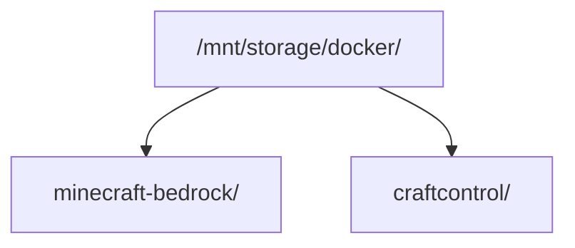

# Installation

This guide installs CraftControl alongside an existing Minecraft Bedrock server.
It is for an operator who wants to run the panel, not for contributors setting
up a development environment.

CraftControl targets a trusted private network. Do not expose port `8082`
directly to the Internet. Put a TLS-terminating reverse proxy in front of it
before making the panel reachable outside your LAN.

## Prerequisites

Before installing, provide:

- Docker Engine with the Compose plugin (`docker compose`);
- an existing [`itzg/minecraft-bedrock-server`](https://github.com/itzg/docker-minecraft-bedrock-server)
  deployment that CraftControl may manage;
- a host path for the CraftControl checkout and persistent state;
- a reverse proxy with HTTPS when `AUTH_COOKIE_SECURE=true`.

Verify Docker before continuing:

```bash
docker --version
docker compose version
```

CraftControl Server is useful without the optional CraftControl Telemetry Pack, Prometheus,
Grafana, Loki, or another observability service.

## Directory layout

Keep the CraftControl checkout and the Bedrock Compose project as sibling
directories, unless you deliberately configure another project mount. The
default production layout is:



The CraftControl Server accesses the Bedrock project, world data, the manager SQLite
database, and coordinated backups. The CraftControl Client has no privileged or
persistent mounts.

## Configure CraftControl

Clone the repository into the `craftcontrol` directory, then create the local
configuration file:

```bash
cd /mnt/storage/docker/craftcontrol
cp .env.example .env
```

Review every value in `.env` before deployment. At minimum, verify:

| Variable | What to check |
| --- | --- |
| `MINECRAFT_CONTAINER` | Matches the running Bedrock container name. |
| `MINECRAFT_PROJECT` | Points to the Bedrock Compose project as mounted in the backend. |
| `MANAGER_PORT` | Is available on the host; the default is `8082`. |
| `AUTH_COOKIE_SECURE` | Keep `true` behind HTTPS; use `false` only for deliberate trusted-LAN HTTP. |
| `TZ` | Matches the timezone used for runtime and analytics. |

Never commit, replace, or copy a production `.env` into another installation.

## Optional: install the CraftControl Host Agent

The CraftControl Host Agent is a systemd service that runs on the Docker host outside all
containers. It handles the privileged container lifecycle operations
(PREPARATION, RESTART, HEALTH_WAIT) so the Server container does not need
unrestricted Docker socket access for those steps. Installing the agent is
optional; the Server falls back to direct Docker Compose access when
`BEDROCK_PROXY_URL` is not set.

### 1. Create the OS user

```bash
sudo useradd --system --no-create-home --shell /usr/sbin/nologin craftcontrol-agent
sudo usermod -aG docker craftcontrol-agent
```

### 2. Generate and store the shared secret

```bash
TOKEN=$(python3 -c "import secrets; print(secrets.token_urlsafe(32), end='')")
sudo mkdir -p /etc/craftcontrol
echo -n "$TOKEN" | sudo install -m 0600 -o craftcontrol-agent -g craftcontrol-agent \
  /dev/stdin /etc/craftcontrol/bedrock-proxy-token
```

Keep `$TOKEN` in a secure location — you will need it for the backend
configuration below. The token value must never appear in a plain environment
variable, log line, or committed file.

### 3. Install the agent

Copy the complete agent source directory to the host, then install the systemd
unit. The agent uses only the Python standard library — no dependency
installation step is required.

```bash
sudo mkdir -p /opt/craftcontrol/bedrock-proxy
sudo cp -r services/bedrock-proxy/. /opt/craftcontrol/bedrock-proxy/
sudo cp deploy/bedrock-proxy/systemd/craftcontrol-bedrock-proxy.service \
  /etc/systemd/system/
sudo systemctl daemon-reload
sudo systemctl enable --now craftcontrol-bedrock-proxy
```

Verify the agent is running:

```bash
sudo systemctl status craftcontrol-bedrock-proxy
curl http://127.0.0.1:7890/v1/health
```

### 4. Configure the backend

Add the following to your `.env` (the token file path is inside the container):

```dotenv
BEDROCK_PROXY_URL=http://host-gateway:7890
BEDROCK_PROXY_TOKEN_FILE=/run/bedrock-proxy-token
```

Then add the token file bind mount to `docker-compose.split.yml` under the
backend service volumes:

```yaml
- /etc/craftcontrol/bedrock-proxy-token:/run/bedrock-proxy-token:ro
```

The backend reads the token once at startup. The `extra_hosts` entry
`host-gateway:host-gateway` must be present in the backend service so the
container can resolve the host IP.

### 5. Restrict network access

Restrict inbound connections on port `7890` to the Docker bridge subnet only.
For example, with `ufw`:

```bash
sudo ufw allow in on docker0 to any port 7890
sudo ufw deny 7890
```

Adjust the interface name to match your Docker bridge (`docker0` is the
default). The agent binds to `0.0.0.0:7890` by default; the firewall rule
provides the network isolation.

See `docs/bedrock-proxy-contract.md` for the full threat model, token rotation
procedure, and permitted operation list.

## Validate and run the cutover

Validate the split Compose topology first:

```bash
docker compose -f docker-compose.split.yml config --quiet
```

Then run the guarded cutover check and cutover:

```bash
bin/cutover-craftcontrol-split --check
bin/cutover-craftcontrol-split
```

The guarded workflow validates mount sources and persistent state before it
changes runtime services. It protects `.env`, `data/manager.db`, and Minecraft
world data. Do not replace it with a bare `docker compose up` from a development
checkout: relative bind mounts can select development state.

For a subsequent production release, use the guarded deployment command from a
clean, published `main` branch:

```bash
bin/deploy-craftcontrol --check
bin/deploy-craftcontrol
```

See [automated deployment](automated-deployment.md) for the repository workflow
that runs this command after a push to `main`.

## Access the panel

Use your HTTPS reverse-proxy hostname in production, for example:

```text
https://craftcontrol.example
```

For a deliberate trusted-LAN installation with secure cookies disabled, open:

```text
http://HOST_IP:8082
```

The frontend owns this public origin and proxies `/api/*` and Server-Sent Events
to the private backend. Do not publish the backend directly.

## Post-install checks

After the cutover, check that:

1. the panel opens at the configured public URL;
2. anonymous API access redirects or rejects requests as expected;
3. the backend and frontend containers are healthy;
4. Bedrock remains reachable and its world data is unchanged;
5. the first player joins Bedrock, then an owner code is generated:

   ```bash
   docker compose -f docker-compose.split.yml exec craftcontrol-backend \
     craftcontrol auth bootstrap --player <gamertag>
   ```

The one-time owner code expires after 15 minutes. Complete account setup in the
panel. Panel roles are separate from Minecraft operator permissions.

Optionally verify the operational integrations:

```bash
docker compose -f docker-compose.split.yml exec craftcontrol-backend craftcontrol telemetry status
docker compose -f docker-compose.split.yml exec craftcontrol-backend craftcontrol backup create
docker compose -f docker-compose.split.yml exec craftcontrol-backend craftcontrol backup list
```

Use [coordinated backup and restore](backup-and-restore.md) for recovery;
restores are offline, explicitly confirmed, and create a recovery copy first.

## Troubleshooting

### The Compose validation fails

Run the command from the CraftControl checkout and use the split file exactly
as shown. Check `.env` for invalid paths, an unavailable port, or a Bedrock
container/project name that does not match the existing deployment.

### The panel does not load

Confirm the frontend container is healthy and that the reverse proxy targets
the host's configured `MANAGER_PORT`. For LAN HTTP, confirm
`AUTH_COOKIE_SECURE=false`; secure cookies cannot be used over plain HTTP.

### The panel loads but API requests fail

Confirm that the backend container is healthy. The browser must use the public
frontend origin, not a backend address or port. This preserves session cookies,
CSRF validation, and the SSE proxy boundary.

### CraftControl cannot manage Bedrock

Verify `MINECRAFT_CONTAINER` and `MINECRAFT_PROJECT` against the existing
Bedrock deployment, then rerun `bin/cutover-craftcontrol-split --check`. Do not
work around a mount validation failure by changing files in the world directory.

### A backup or restore is needed

Use only the coordinated backup commands. Do not copy a live SQLite database or
world directory manually. See [coordinated backup and restore](backup-and-restore.md).
