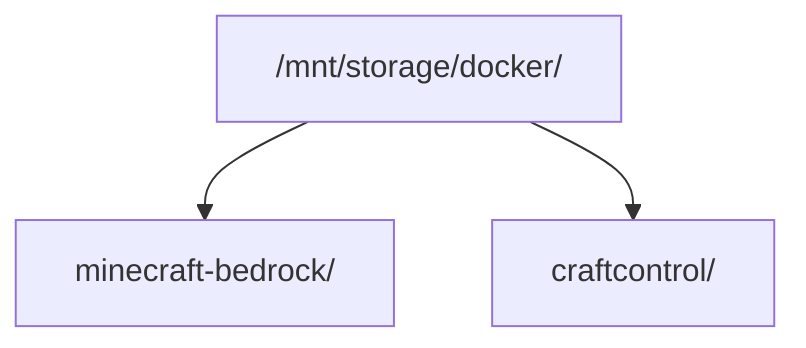

# Instalação

Este guia instala o CraftControl ao lado de um servidor Minecraft Bedrock já existente. Ele é destinado ao operador que quer executar o painel, não a quem prepara um ambiente de desenvolvimento.

O CraftControl é destinado a uma rede privada confiável. Não exponha a porta `8082` diretamente à Internet. Antes de disponibilizar o painel fora da LAN, coloque um proxy reverso com terminação TLS à frente dele.

## Pré-requisitos

Antes de instalar, providencie:

- Docker Engine com o plugin Compose (`docker compose`);
- uma implantação existente de [`itzg/minecraft-bedrock-server`](https://github.com/itzg/docker-minecraft-bedrock-server);
- um caminho persistente no host para o checkout e o estado do CraftControl;
- um proxy reverso HTTPS quando `AUTH_COOKIE_SECURE=true`.

Verifique o Docker:

```bash
docker --version
docker compose version
```

O CraftControl continua útil sem o Telemetry Pack opcional, Prometheus, Grafana, Loki ou outro serviço de observabilidade.

## Layout de diretórios

Mantenha o checkout do CraftControl e o projeto Compose do Bedrock como diretórios irmãos, a menos que configure deliberadamente outra montagem:



O backend acessa o projeto Bedrock, dados do mundo, banco SQLite do gerenciador e backups coordenados. O frontend não recebe montagens privilegiadas ou persistentes.

## Configure o CraftControl

Clone o repositório no diretório `craftcontrol` e crie a configuração local:

```bash
cd /mnt/storage/docker/craftcontrol
cp .env.example .env
```

Revise cada valor de `.env` antes da implantação:

| Variável | O que conferir |
| --- | --- |
| `MINECRAFT_CONTAINER` | Corresponde ao contêiner Bedrock em execução. |
| `MINECRAFT_PROJECT` | Aponta para o projeto Compose Bedrock montado no backend. |
| `MANAGER_PORT` | Está disponível no host; o padrão é `8082`. |
| `AUTH_COOKIE_SECURE` | Mantenha `true` atrás de HTTPS; use `false` somente para HTTP deliberado em LAN confiável. |
| `TZ` | Corresponde ao fuso do runtime e das análises. |

Nunca versione, substitua ou copie um `.env` de produção para outra instalação.

## Valide e execute o cutover

Primeiro valide a topologia Compose dividida:

```bash
docker compose -f docker-compose.split.yml config --quiet
```

Em seguida execute a verificação e o cutover protegidos:

```bash
bin/cutover-craftcontrol-split --check
bin/cutover-craftcontrol-split
```

O fluxo protegido valida fontes de montagem e estado persistente antes de mudar serviços. Ele protege `.env`, `data/manager.db` e os dados do mundo Minecraft. Não o substitua por `docker compose up` sem opções em um checkout de desenvolvimento: bind mounts relativos podem selecionar estado de desenvolvimento.

Para releases posteriores, use o comando protegido a partir de uma branch `main` limpa e publicada:

```bash
bin/deploy-craftcontrol --check
bin/deploy-craftcontrol
```

Veja [implantação automatizada](automated-deployment.md) para o fluxo que executa esse comando após um push para `main`.

## Acesse o painel

Em produção, use o hostname HTTPS do proxy reverso, por exemplo `https://craftcontrol.example`. Em uma instalação deliberada de LAN confiável com cookies seguros desativados, abra `http://HOST_IP:8082`.

O frontend é dono dessa origem pública e encaminha `/api/*` e Server-Sent Events para o backend privado. Não publique o backend diretamente.

## Verificações pós-instalação

Após o cutover, confira que o painel abre na URL configurada, o acesso anônimo à API é rejeitado, os contêineres estão saudáveis e o Bedrock continua acessível sem mudança nos dados do mundo. Depois que o primeiro jogador entrar no Bedrock, gere o código inicial de proprietário:

```bash
docker compose -f docker-compose.split.yml exec craftcontrol-backend \
  craftcontrol auth bootstrap --player <gamertag>
```

O código expira após 15 minutos. Conclua a criação da conta no painel; papéis do painel são independentes das permissões de operador Minecraft.

Opcionalmente, verifique telemetria e backup:

```bash
docker compose -f docker-compose.split.yml exec craftcontrol-backend craftcontrol telemetry status
docker compose -f docker-compose.split.yml exec craftcontrol-backend craftcontrol backup create
docker compose -f docker-compose.split.yml exec craftcontrol-backend craftcontrol backup list
```

Use [backup e restauração coordenados](backup-and-restore.md) para recuperação. Restaurações são offline, confirmadas explicitamente e criam uma cópia de recuperação antes da alteração.

## Solução de problemas

### A validação do Compose falha

Execute o comando a partir do checkout do CraftControl e use exatamente o arquivo dividido indicado. Confira `.env` para caminhos inválidos, porta indisponível ou nome de contêiner/projeto Bedrock incorreto.

### O painel não carrega

Confirme que o frontend está saudável e que o proxy reverso aponta para a `MANAGER_PORT` configurada. Em HTTP na LAN, confirme `AUTH_COOKIE_SECURE=false`; cookies seguros não funcionam sobre HTTP simples.

### O painel carrega, mas a API falha

Confirme que o backend está saudável. O navegador deve usar a origem pública do frontend, e não um endereço ou porta do backend, para preservar cookies de sessão, validação CSRF e a fronteira SSE.

### O CraftControl não consegue gerenciar o Bedrock

Verifique `MINECRAFT_CONTAINER` e `MINECRAFT_PROJECT`, depois execute novamente `bin/cutover-craftcontrol-split --check`. Não contorne uma falha de validação de montagem alterando arquivos no diretório do mundo.

### É necessário backup ou restauração

Use somente comandos de backup coordenado. Não copie manualmente um banco SQLite ou diretório de mundo em uso. Veja [backup e restauração coordenados](backup-and-restore.md).
