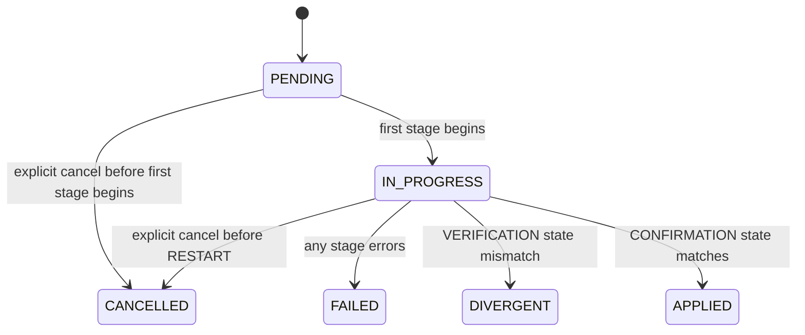

# Operation Lifecycle and Evidence Contract

This document is the canonical contract for server operations — specifically
restart-required changes — in CraftControl. Backend services, adapters, and
the frontend consume this contract. Future executor replacements must emit the
same shape; application consumers require no lifecycle redesign when an executor
is swapped.

---

## Scope

An **operation** is any change to server configuration or state that requires
a controlled restart sequence. The contract does not cover backup-only flows or
gamerule changes that apply at runtime without a restart.

## Operator experience

The browser presents an operation in an application-level drawer, rather than
inside the Server area. Closing that drawer never cancels, pauses, or hides the
operation: the SSE subscription continues and a persistent indicator reopens
the drawer from any page. The drawer remains the single surface for stages,
evidence, recovery actions, and the latest completed outcome.

---

## Correlation identifier

Every operation is assigned a stable `operation_id` (UUID v4) at the moment the
change is accepted by the application service. The identifier travels through all
stages, persisted records, SSE events, log annotations, and executor payloads. A
single `operation_id` unambiguously links every artefact produced during the
lifecycle of one change.

---

## Stages

Operations progress through a fixed sequence of named stages. A stage
represents a discrete unit of work with a defined owner and observable outcome.

| Stage | Name | Description |
|---|---|---|
| 1 | `REVIEW` | Application validates the requested change against current configuration and RBAC. |
| 2 | `BACKUP_VERIFICATION` | A backup is confirmed as current and healthy before any destructive step proceeds. |
| 3 | `PREPARATION` | Canonical Bedrock configuration files are written. The Compose project is staged without duplicating managed server settings. |
| 4 | `RESTART` | The executor (Compose adapter or host agent) issues the restart command. |
| 5 | `HEALTH_WAIT` | The health probe polls until the server reports ready or the deadline elapses. |
| 6 | `VERIFICATION` | The application reads server state and compares it to the intended post-change state. |
| 7 | `CONFIRMATION` | The outcome is recorded, SSE event emitted, and the operation sealed. |

---

## States

Each stage transition produces one of the following operation states. States are
cumulative labels on the operation record, not per-stage fields.

| State | Description |
|---|---|
| `PENDING` | Operation accepted; no stage has begun. |
| `IN_PROGRESS` | At least one stage is running. |
| `APPLIED` | All stages completed and observed state matches intended state. |
| `FAILED` | A stage returned an error and the operation cannot continue. |
| `DIVERGENT` | The executor command succeeded but observed server state disagrees with intended state. |
| `CANCELLED` | The operation was cancelled before reaching `RESTART`. |

`DIVERGENT` is a first-class terminal outcome, not a subtype of `FAILED`. A
divergent result means the platform accepted the command but the resulting state
is unexpected. Callers must not conflate divergence with failure: the failure
path triggers an alert and requires a new operation or manual corrective action
(no automatic rollback occurs within this contract), while the divergence path
triggers an alert and manual review. An operation can transition to `DIVERGENT`
only from `VERIFICATION`.

When state is `FAILED`, the application service records `error_detail`, emits
`operation.failed`, and seals the record. No rollback is initiated
automatically. Corrective action — whether a new operation, a manual restore, or
an operator intervention — is outside the scope of this contract and must be
initiated explicitly by the operator.

Before a failed operation is published, CraftControl performs a read-only
configuration reconciliation when the server is reachable. The requested
The requested value is never proof that Bedrock applied it: `server.properties` is
authoritative for the effective value. Evidence includes expected settings,
observed settings, differences, and a `reconciliation_result` of `applied`,
`diverged`, or `unknown`. A divergent result must display the observed value;
an unknown result must never display the requested value as applied. This check
never restarts, recreates, or writes to Bedrock.

---

## Transitions



`APPLIED`, `FAILED`, `DIVERGENT`, and `CANCELLED` are terminal. No transition
out of a terminal state is valid.

---

## Evidence fields

All operation timestamps in API and SSE payloads are UTC ISO 8601 strings
(`YYYY-MM-DDTHH:mm:ss.sssZ`), or `null` when the event has not occurred.
Persistence may retain legacy epoch-second values; CraftControl converts them
at the API boundary without changing operation ordering.

The following fields are recorded on the operation record. All timestamps are
UTC ISO 8601.

| Field | Type | Description |
|---|---|---|
| `operation_id` | UUID | Stable correlation identifier assigned at acceptance. |
| `operation_type` | string | Identifies the class of change (e.g. `server_settings_update`). |
| `state` | enum | Current operation state (see States). |
| `current_stage` | enum \| null | Active stage name; null when terminal. |
| `initiated_by` | string | Username of the panel user who requested the change. |
| `created_at` | datetime | Timestamp when the operation was accepted. |
| `updated_at` | datetime | Timestamp of the most recent state or stage transition. |
| `completed_at` | datetime \| null | Timestamp of the terminal transition; null while in progress. |
| `stage_log` | list | Ordered log of stage entries (see Stage log entry). |
| `intended_state` | object | Snapshot of the configuration as it should appear after the operation. |
| `observed_state` | object \| null | Snapshot read during VERIFICATION; null until that stage runs. |
| `divergence_detail` | list\<object\> \| null | Fields where observed state differs from intended state; null when not divergent. |
| `executor_ref` | string \| null | Opaque identifier returned by the executor (e.g. Compose service name + restart token). |
| `error_detail` | object \| null | Structured error populated when state is FAILED. |

### `error_detail` schema

| Field | Type | Description |
|---|---|---|
| `code` | string | Machine-readable error code (e.g. `executor_timeout`, `health_probe_failed`). |
| `message` | string | Human-readable error description. |
| `stage` | enum | The stage in which the error occurred. |
| `exception_type` | string \| null | Python exception class name, if applicable. |

### `divergence_detail` schema

A list of objects, one per mismatched field.

| Field | Type | Description |
|---|---|---|
| `field` | string | Dot-separated path to the mismatched field within the state snapshot (e.g. `difficulty`). |
| `intended` | any | The value expected after the operation. |
| `observed` | any | The value read during VERIFICATION. |

### Stage log entry

Each entry in `stage_log` captures one stage attempt.

| Field | Type | Description |
|---|---|---|
| `stage` | enum | Stage name. |
| `started_at` | datetime | When the stage began. |
| `completed_at` | datetime \| null | When the stage finished; null if still running. |
| `outcome` | `ok` \| `error` \| `skipped` | Result of this stage. |
| `detail` | string \| null | Human-readable summary, error message, or skip reason. |

---

## Ownership boundaries

The contract is owned by the **application layer**. Adapters and the UI are
consumers.

| Concern | Owner |
|---|---|
| Assigning `operation_id` | Application service (at acceptance) |
| Validating the change and checking RBAC | Application service (REVIEW stage) |
| Confirming backup currency | Application service via backup port (BACKUP_VERIFICATION stage) |
| Writing configuration files | Compose adapter (PREPARATION stage) |
| Issuing the restart command | Compose adapter or host agent (RESTART stage) |
| Polling health | Compose adapter or host agent (HEALTH_WAIT stage) |
| Reading observed state | Application service via server port (VERIFICATION stage) |
| Comparing intended vs observed state | Application service (VERIFICATION stage) |
| Persisting the operation record and emitting SSE | Application service (all stages) |
| Displaying state and divergence to the user | Frontend, reading SSE and the operations endpoint |

The Compose adapter and the host agent are interchangeable **executors**. An
executor is responsible only for PREPARATION, RESTART, and HEALTH_WAIT. It
reports back a structured result that the application service uses to advance the
stage log. Executors do not write to the operation record directly.

### Executor invocation

The application service invokes the executor with at minimum:

| Field | Type | Description |
|---|---|---|
| `operation_id` | UUID | The stable correlation identifier for this operation. Executors must include it in any logs or audit records they produce. |
| `intended_state` | object | The configuration snapshot the executor must apply. |

### Executor result shape

An executor must return a plain object with the following fields after completing
its scope (PREPARATION through HEALTH_WAIT):

| Field | Type | Description |
|---|---|---|
| `outcome` | `ok` \| `error` | Whether the executor completed its scope without error. |
| `executor_ref` | string \| null | Opaque executor-local handle for correlation and audit. |
| `health_reached` | bool \| null | `true` if the health probe confirmed server readiness within the deadline; `false` if the probe ran and timed out or failed; `null` if the probe never ran because a prior stage (`PREPARATION` or `RESTART`) failed. |
| `failed_stage` | enum \| null | The stage at which an error occurred (`PREPARATION`, `RESTART`, or `HEALTH_WAIT`); null when `outcome` is `ok`. |
| `detail` | string \| null | Human-readable summary or error message. Becomes `error_detail.message` when `outcome` is `error`. |
| `error_code` | string \| null | Machine-readable error code (e.g. `executor_timeout`, `health_probe_failed`); null when `outcome` is `ok`. Becomes `error_detail.code`. |
| `exception_type` | string \| null | Python exception class name if an unhandled exception caused the failure; null otherwise. Becomes `error_detail.exception_type`. |

**Conditional schema:** when `outcome` is `error`, `failed_stage`, `detail`, and
`error_code` must all be non-null; `exception_type` remains optional. When
`outcome` is `ok`, all three must be null.

**Invariants for `health_reached`:**

- `health_reached: false` — the probe ran and did not confirm readiness; the
  executor **must** set `outcome: error` and `failed_stage: HEALTH_WAIT`.
- `health_reached: null` — the probe never ran because `PREPARATION` or
  `RESTART` failed; `failed_stage` must be `PREPARATION` or `RESTART`
  respectively.
- `health_reached: true` — the probe succeeded; `outcome` must be `ok`.

Any other combination is a contract violation and must be rejected by the
application service.

Because the executor covers three stages (PREPARATION, RESTART, HEALTH_WAIT) but
returns a single result object, the application service is responsible for
expanding it into per-stage `stage_log` entries. The mapping rule is:

- Stages preceding `failed_stage` receive `outcome: ok`.
- `failed_stage` receives `outcome: error`; its `stage_log` entry's `detail`
  is set from `detail`, and the operation record's `error_detail` is populated
  from `error_code` → `code`, `detail` → `message`, `failed_stage` → `stage`,
  `exception_type` → `exception_type`.
- Stages after `failed_stage` receive `outcome: skipped`.
- When `outcome` is `ok`, all three stages receive `outcome: ok`; `health_reached`
  is reflected in the `HEALTH_WAIT` entry's `detail`.

A future host agent that emits this same shape requires no changes to the
application layer.

### Application-service stage failures

For stages owned directly by the application service (REVIEW, BACKUP_VERIFICATION,
VERIFICATION, CONFIRMATION), failures do not go through the executor result shape.
The application service writes the `stage_log` entry and `error_detail` directly:

- The failing stage's `stage_log` entry receives `outcome: error` and a `detail`
  string describing the failure.
- `error_detail` is populated with `code`, `message`, and `stage`; `exception_type`
  is set if an unhandled exception caused the failure.
- All subsequent stages receive `outcome: skipped`.
- The operation transitions to `FAILED`.

The `skipped` outcome in `stage_log` is not limited to executor stages; any stage
that does not run because a prior stage failed records `outcome: skipped`.

### Cancellation semantics

`CANCELLED` is only valid before the RESTART stage begins. If a cancel request
arrives after PREPARATION has written configuration files but before RESTART
executes, the application service must:

1. Record a `stage_log` entry for PREPARATION with `outcome: ok` (already
   written) and mark RESTART and all subsequent stages as `outcome: skipped`.
2. Invoke the active executor's rollback capability with `operation_id` and the
   prepared state before transitioning the operation to `CANCELLED`. The executor
   (Compose adapter or host agent) is responsible for undoing its own PREPARATION
   work and returning a structured result with `outcome` and `detail`.
3. Emit `operation.cancelled` only after the rollback completes or is confirmed
   as a no-op.

If rollback fails, the operation transitions to `FAILED` rather than `CANCELLED`,
with `error_detail` describing the rollback failure.

---

## Divergent state

A result is divergent when all of the following are true after VERIFICATION:

1. The executor returned `outcome: ok`.
2. The health probe confirmed readiness (`health_reached: true`).
3. One or more fields in `observed_state` do not match the corresponding fields
   in `intended_state`.

`divergence_detail` lists each mismatched field with its intended and observed
values. The operation transitions to `DIVERGENT` and no further automatic
corrective action is taken. An SSE event of type `operation.divergent` is
emitted. The panel displays the divergence detail and prompts the operator for
manual review.

---

## Timestamps and ordering guarantees

`created_at` is the anchor for the operation record. All stage `started_at`
values must be monotonically increasing relative to `created_at`. The
application service enforces this; executors must not backdate timestamps.

`completed_at` is written atomically with the terminal state transition. No
additional updates to `state` or `current_stage` are valid after
`completed_at` is set.

---

## SSE event types

Operations emit the following event types over the SSE stream.

| Event type | When emitted |
|---|---|
| `operation.created` | Operation accepted; PENDING state recorded. |
| `operation.stage_started` | A stage begins. |
| `operation.stage_completed` | A stage finishes (ok, error, or skipped). |
| `operation.applied` | Terminal: all stages succeeded, state matches. |
| `operation.failed` | Terminal: a stage returned an error. |
| `operation.divergent` | Terminal: executor succeeded but observed state mismatches. |
| `operation.cancelled` | Terminal: cancelled before RESTART. |

### SSE wire format

Each message is a standard SSE frame with the following fields:

Operations events flow through the same `/api/events` SSE endpoint and
`EventBroker` used by the rest of the platform. The wire format is:

```text
id: <durable integer from EventStore, monotonically increasing across restarts>
event: state
data: {"topic": "<event-type>", "timestamp": <unix float>, "source": "<service>", "payload": {…}}
```

The `event:` field is always the literal string `state` (the existing platform
convention). Consumers differentiate operation events from other platform events
using the `topic` key. The operation-specific fields are carried inside `payload`:

| Field | Type | Description |

| Field | Type | Description |
|---|---|---|
| `topic` | string | One of the event type values from the table above (e.g. `operation.applied`). |
| `operation_id` | UUID | Correlation identifier for the operation. |
| `state` | enum | Current operation state at the time of emission. |
| `current_stage` | enum \| null | Active stage name; null when terminal. |
| `updated_at` | datetime | UTC ISO 8601 timestamp of the transition that triggered this event. |
| `completed_at` | datetime \| null | Set only on terminal events; null otherwise. |
| `stage` | enum \| null | Stage name for `operation.stage_started` and `operation.stage_completed`; null for other events. |
| `stage_outcome` | `ok` \| `error` \| `skipped` \| null | Stage result for `operation.stage_completed`; null for other events. |
| `error_detail` | object \| null | Populated on `operation.failed`; null otherwise. |
| `divergence_detail` | list\<object\> \| null | Populated on `operation.divergent`; null otherwise. See `divergence_detail` schema above. |

### Replay and ordering guarantees

The SSE `id:` field is the durable `EventStore` integer — it persists across
server restarts and is not connection-scoped. Clients may send `Last-Event-ID`
on reconnect; the server replays stored events with an id greater than the
supplied value.

**Known gap — replay race:** `EventBroker.stream` replays stored events and
then registers the subscriber. An event published in the window between those
two operations will not appear in the replay or the live queue. Until this race
is closed, clients should treat `GET /api/operations/{id}` as the authoritative
source after reconnect and use SSE only for incremental updates.

**Known gap — replay page limit:** `EventStore.events_after` returns at most
100 events per call. After an outage with more than 100 buffered events, the
replay is incomplete and no cursor or continuation is provided. Clients must
not assume a complete replay; they must re-fetch the operations endpoint to
resynchronise state after any reconnect gap longer than a few seconds.

Deduplication is the client's responsibility. Because `operation.stage_started`
and `operation.stage_completed` can fire for multiple stages within the same
operation, deduplicating on `(operation_id, topic)` alone would discard valid
events. Clients must use the SSE `id:` sequence number as the primary
deduplication key: if a frame with a given `id` has already been applied, discard
it. When `id` is unavailable (e.g. during replay), use
`(operation_id, topic, stage, updated_at)` as the composite key and apply only
the frame with the highest `updated_at` among duplicates.

The application service guarantees that a terminal SSE event is emitted only
after the corresponding operation record has been committed to SQLite. A client
that receives a terminal event may safely fetch the operations endpoint and
expect the record to reflect the final state.
